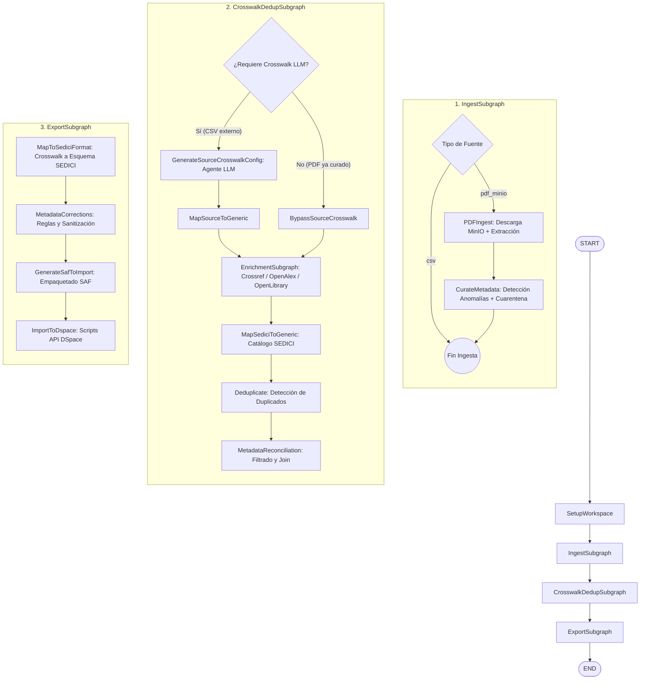

# Bulk Importation Workflow (Módulo Marta)
> **Orquestador Inteligente de Importación Masiva para Repositorios Digitales (SEDICI / DSpace)**  
> *Proyecto de Tesis de Grado — Licenciatura en Sistemas / Informática (UNLP — PREBI-SEDICI)*

---

## 📌 Descripción General

El **Bulk Importation Workflow** es un orquestador de servicios y flujo de trabajo inteligente desarrollado con **LangGraph** y el protocolo **MCP (Model Context Protocol)**. Su objetivo principal es automatizar, enriquecer, validar y auditar el proceso de importación masiva de documentos y registros bibliográficos hacia el repositorio institucional **[SEDICI](http://sedici.unlp.edu.ar/)** (basado en **DSpace 7+**).

El sistema aborda desafíos críticos en la gestión de repositorios académicos:
1. **Heterogeneidad de Fuentes**: Ingesta tanto de fuentes estructuradas (CSVs con metadatos de DOAJ, Springer, SciELO, etc.) como no estructuradas (documentos PDF almacenados en MinIO que requieren extracción y curación de metadatos).
2. **Mapeo Semántico Adaptativo (Crosswalk)**: Inferencia dinámica y validación con Modelos de Lenguaje (LLMs) para mapear esquemas dispares hacia un formato genérico común y posteriormente hacia el esquema calificado de SEDICI.
3. **Curación y Detección de Anomalías**: Verificación heurística y mediante agentes LLM de la calidad de metadatos extraídos de PDFs, aislando registros inconsistentes en cuarentena para revisión humana.
4. **Enriquecimiento Automatizado**: Consulta paralela y jerárquica a fuentes académicas externas (Crossref, OpenAlex, OpenLibrary y negociación de contenido DOI) para subsanar metadatos incompletos antes de la deduplicación.
5. **Deduplicación y Reconciliación**: Detección de registros duplicados contra el catálogo histórico de SEDICI mediante microservicios especializados con umbrales de confianza configurables.
6. **Empaquetado Estándar y Carga**: Generación automática de paquetes en estructura **SAF (*Simple Archive Format*)** e importación directa en DSpace mediante su Scripts API.

---

## 🏗️ Arquitectura del Sistema

El pipeline principal (`ImportPipelineGraph` en `core/graph.py`) está estructurado como una máquina de estados determinista y modular compuesta por **subgrafos secuenciales (`StateGraph`)**:



### Detalle de las Fases y Subgrafos

1. **`SetupWorkspace`**:
   - Inicializa el entorno de ejecución creando un directorio de trabajo específico (`runs/{source_name}_{timestamp}_{cant}`) donde se preservan todos los artefactos intermedios generados.

2. **`IngestSubgraph` (`core/subgraphs/ingest.py`)**:
   - **Flujo CSV**: Si la entrada es un archivo tabular provisto por el usuario, omite el procesamiento de archivos y pasa directo a la siguiente fase.
   - **Flujo PDF en MinIO**: Descarga los archivos PDF desde buckets S3/MinIO, ejecuta el servicio de extracción de metadatos y aplica curación automática (`CurateMetadata` / `MetadataCuratorAgent`), detectando anomalías o campos truncados y separando los ítems en:
     - `curated_csv_path`: Registros aprobados listos para importar.
     - `pending_to_review_csv_path`: Registros dudosos enviados a cuarentena para auditoría manual.

3. **`CrosswalkDedupSubgraph` (`core/subgraphs/crosswalk_dedup.py`)**:
   - **Generación de Crosswalk**: Si el origen es un CSV externo con columnas desconocidas, el agente `crosswalk_agent` analiza las cabeceras, tipos y separadores para construir un archivo de mapeo semántico hacia las columnas genéricas unificadas.
   - **`EnrichmentSubgraph` (`core/subgraphs/enrichment.py`)**: Si `enrichment_enabled=True`, evalúa cada ítem según su identificador disponible:
     - Con **DOI** $\rightarrow$ Consulta autoritativa a Crossref (con fallback a DOI Content Negotiation).
     - Sin DOI pero con **ISSN** o **Título** $\rightarrow$ Consulta a OpenAlex.
     - Libros con **ISBN** $\rightarrow$ Consulta a OpenLibrary.
   - **Deduplicación**: Cruza los metadatos genéricos del lote contra la base exportada de SEDICI mediante el microservicio deduplicador. Aplica umbrales seguros (por debajo del 10% de similitud) y de revisión (por encima del 30%).
   - **Reconciliación**: Realiza el cruce (*join*) reteniendo únicamente los ítems no duplicados y preservando la integridad de los metadatos originales.

4. **`ExportSubgraph` (`core/subgraphs/export.py`)**:
   - **Mapeo a Esquema SEDICI**: Traduce las columnas genéricas reconciliadas al esquema final de metadatos calificados de SEDICI.
   - **Correcciones Programáticas**: Aplica filtros de limpieza institucional, normalización de autores, fechas y tipologías documentales.
   - **Generación de SAF**: Estructura las carpetas de ítems con sus respectivos archivos `dublin_core.xml`, `metadata_sedici.xml`, archivos `contents` y bitstreams asociados.
   - **Importación a DSpace**: Invoca la herramienta `dspace import` a través de la API REST / Scripts API de DSpace (con soporte de modo validación previa `import_validate_only`).

---

## 🛠️ Tecnologías y Herramientas

### Núcleo de Orquestación e IA
- **[LangGraph](https://github.com/langchain-ai/langgraph)** & **[LangChain](https://github.com/langchain-ai/langchain)**: Definición del grafo de estados, checkpointing, routing condicional y gestión de agentes autónomos.
- **Model Context Protocol (MCP)**: Estandarización de herramientas e integraciones externas mediante FastMCP y adaptadores LangChain.
- **Modelos de Lenguaje**: Integraciones flexibles vía LangChain y OpenRouter/APIs directas con soporte para:
  - OpenAI (modelos de razonamiento y extracción)
  - Google Gemini (`gemini-3.1-flash-lite-preview`, etc.)
  - Groq & NVIDIA NIM (modelos de inferencia ultrarrápida como Nemotron)

### Integraciones y Servicios (MCPs)
- **DSpace MCP**: Interacción con DSpace 7+ (autenticación REST, endpoints administrativos y ejecución de scripts SAF).
- **Deduplicator MCP**: Microservicio para cálculo de distancias y similitud textual entre registros.
- **MinIO MCP**: Cliente S3 para manipulación de buckets, subida y descarga de archivos PDF.
- **OpenAlex MCP & Crossref MCP**: Consultas bibliográficas para enriquecimiento de registros científicos.
- **Springer MCP**: Integración con APIs de metadatos editoriales de Springer Nature.

### Extracción de Texto y RAG
- **PyMuPDF (fitz)**, **PyTesseract** y **Pillow**: Análisis de PDFs, extracción de texto y OCR de portadas.
- **ChromaDB** & **FAISS**: Almacenamiento vectorial para recuperación de playbooks, contextos y memorias procedurales.
- **Sentence Transformers**: Embeddings multilingües (`paraphrase-multilingual-MiniLM-L12-v2`).

### Infraestructura y Persistencia
- **Docker & Docker Compose**: Contenedorización de DSpace, MinIO, microservicios y servidores MCP.
- **SQLite (Async Checkpointer)**: Persistencia de estado, auditoría y recuperación de puntos de control en ejecuciones del grafo.
- **LangGraph CLI & Studio**: Interfaz de visualización, depuración y ejecución interactiva en tiempo real.

---

## 📁 Estructura del Proyecto

```text
Modulo-Marta/
├── AGENTS.md                  # Reglas del proyecto, directivas de estilo y contexto de tesis
├── Makefile                   # Automatización de tareas (up, down, build, logs)
├── docker-compose.yml         # Contenedores para MCPs (DSpace, MinIO, Deduplicator, Springer)
├── langgraph.json             # Configuración para despliegue en LangGraph Studio / Platform
├── requirements.txt           # Dependencias de Python
├── agent_prompts/             # Prompts versionados en Markdown para los agentes LLM
│   ├── crosswalk_agent.md
│   ├── metadata_curator_agent.md
│   ├── metadata_extractor_agent.md
│   └── ...
├── core/                      # Código fuente principal del orquestador
│   ├── graph.py               # Ensamblador del pipeline principal (ImportPipelineGraph)
│   ├── state.py               # Definición del TypedDict State centralizado
│   ├── agent/                 # Agentes especializados (curador, extractor, dspace, minio, etc.)
│   ├── clients/               # Clientes de servicios externos y conectores de enriquecimiento
│   ├── nodes/                 # Nodos de LangGraph (pipeline_nodes, crosswalk_agent, etc.)
│   ├── scripts/               # Scripts legacy y librerías auxiliares (crosswalk, SAF packager)
│   ├── subgraphs/             # Subgrafos modulares (ingest, crosswalk_dedup, enrichment, export)
│   └── utils/                 # Configuración general y utilidades auxiliares
├── docs/                      # Documentación técnica de arquitectura y subsistemas
│   ├── curation_pipeline.md
│   ├── enrichment_optimization_strategies.md
│   └── separator_normalization_alternatives.md
├── mcps/                      # Implementaciones de los servidores MCP
│   ├── crossref_mcp/
│   ├── deduplicator_mcp/
│   ├── dspace_mcp/
│   ├── minio_mcp/
│   ├── openalex_mcp/
│   └── springer_mcp/
├── scripts/                   # Scripts de evaluación, push de prompts y benchmarks
└── tests/                     # Suite de pruebas unitarias y de integración
    ├── data/                  # Conjuntos de datos reales y sintéticos de prueba
    ├── integration/           # Tests de integración de fases, nodos y subgrafos
    └── unit/                  # Tests unitarios de funciones y transformaciones
```

---

## 🚀 Instalación y Configuración

### 1. Requisitos Previos
- **Linux** (recomendado Ubuntu 20.04+ o Debian 11+).
- **Python 3.11+** con módulo `venv`.
- **Docker** y **Docker Compose v2+**.
- **Make** instalado en el sistema.

### 2. Creación del Entorno Virtual
```bash
# Clonar o situarse en la raíz del repositorio
cd /home/santi/Documentos/LangGraph/Modulo-Marta

# Crear el entorno virtual
python3 -m venv .venv

# Activar el entorno virtual
source .venv/bin/activate

# Actualizar gestor de paquetes e instalar dependencias
pip install --upgrade pip
pip install -r requirements.txt
```

### 3. Variables de Entorno
Copiar o configurar el archivo `.env` en la raíz del proyecto basándose en las variables requeridas:

```dotenv
# Proveedores de Modelos (LLMs)
GEMINI_API_KEY="tu-clave-gemini"
GROQ_API_KEY="tu-clave-groq"
OPEN_ROUTER_API_KEY="tu-clave-openrouter"
NVIDIA_API_KEY="tu-clave-nvidia"

# Trazabilidad con LangSmith (Opcional pero recomendado)
LANGCHAIN_TRACING_V2=true
LANGCHAIN_ENDPOINT="https://api.smith.langchain.com"
LANGCHAIN_API_KEY="tu-clave-langsmith"
LANGCHAIN_PROJECT="Bulk-Importation-Workflow"

# DSpace & Repositorio
DSPACE_BASE_URL="http://localhost:8080/server"
DSPACE_EMAIL="admin@dspace.org"
DSPACE_PASSWORD="admin"

# MinIO
MINIO_ROOT_USER="admin"
MINIO_ROOT_PASSWORD="adminpassword"

# APIs de Enriquecimiento
OPENALEX_EMAIL="tu-email@institucion.edu.ar"
SPRINGER_API_KEY="tu-clave-springer"
```

---

## 💻 Ejecución y Operación

### 1. Iniciar los Servicios y la Plataforma
El archivo `Makefile` provisto automatiza la puesta en marcha de los servicios complementarios (DSpace, Deduplicador, MinIO, MCPs) y del servidor local de LangGraph:

```bash
# Levantar todos los servicios e iniciar LangGraph en modo desarrollo
make up
```

Este comando:
1. Inicia los contenedores de DSpace y el servicio externo de deduplicación.
2. Inicia los contenedores de los servidores MCP definidos en `docker-compose.yml`.
3. Lanza el servidor de desarrollo de LangGraph (`langgraph dev --allow-blocking`).

### 2. Visualización y Depuración en LangGraph Studio
Una vez ejecutado `make up`, abrir la interfaz web de **LangGraph Studio** en el navegador para:
- Inspeccionar la estructura del grafo `supervisor` (`ImportPipelineGraph`).
- Disparar ejecuciones parametrizando el estado inicial `State` (ej. especificando `source_csv_path`, `input_source_type: "csv"` o `"pdf_minio"` y `enrichment_enabled: true`).
- Monitorear el progreso paso a paso y el flujo de datos entre subgrafos.

### 3. Comandos Útiles del `Makefile`

```bash
# Ver logs consolidados de los contenedores MCP
make logs

# Reconstruir las imágenes de los servidores MCP (incluyendo OpenAlex en stdio)
make build

# Reiniciar únicamente los servicios MCP
make restart

# Detener todos los servicios y contenedores de soporte
make down
```

---

## 🧪 Pruebas y Verificación

El proyecto cuenta con un conjunto extenso de pruebas automatizadas mediante `pytest`, abarcando tanto funciones unitarias como tests de integración con mocks para servicios externos:

```bash
# Asegurarse de tener el entorno virtual activo
source .venv/bin/activate

# Ejecutar todos los tests unitarios y de integración
pytest

# Ejecutar pruebas de los pasos del grafo principal
pytest tests/integration/test_graph_steps.py -v

# Ejecutar tests de un subgrafo específico (ej. Crosswalk & Deduplicación)
pytest tests/integration/subgraphs/test_crosswalk_dedup_subgraph.py -v

# Evaluar el agente de curación de metadatos
pytest tests/integration/test_metadata_curator_agent.py -v
```