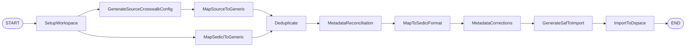
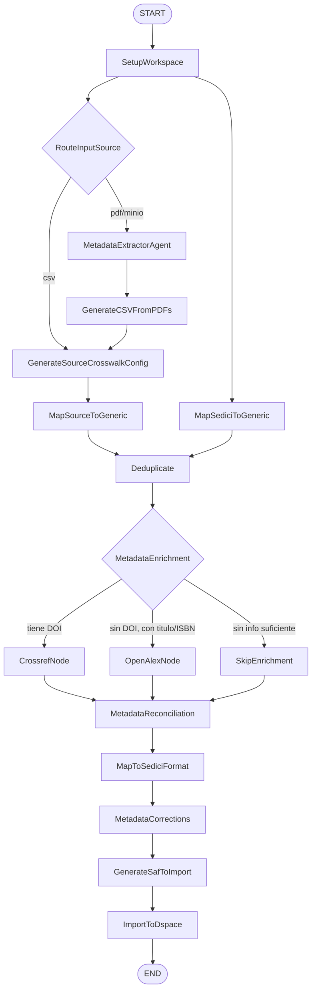
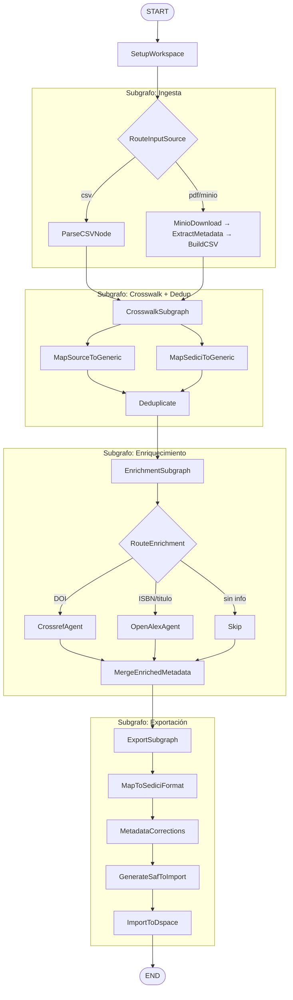
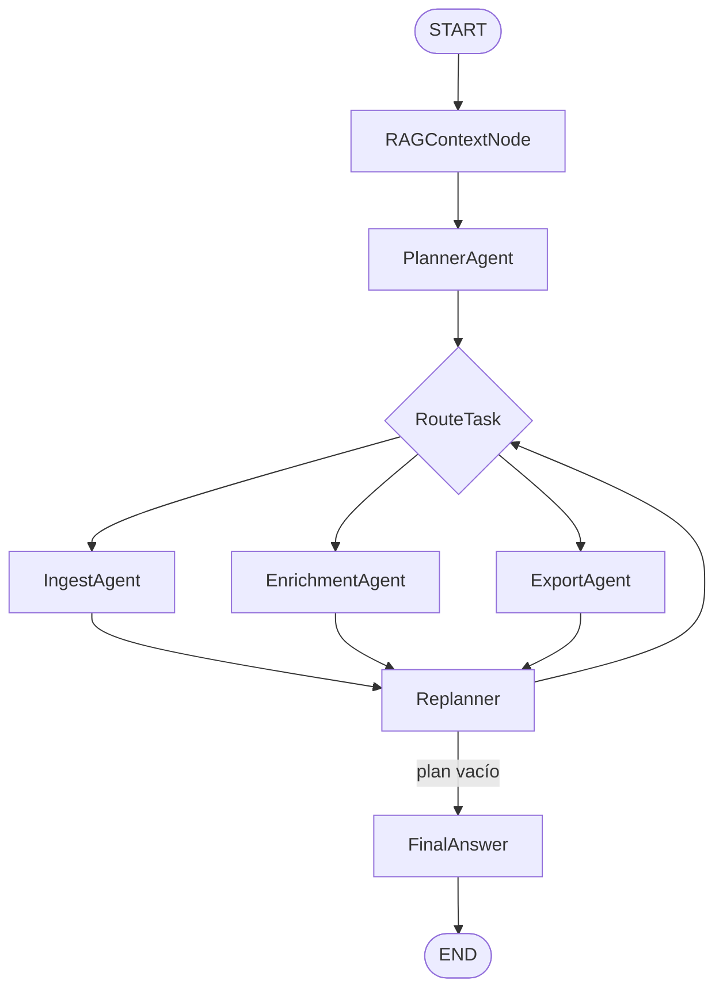
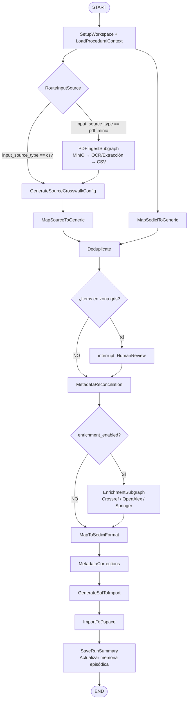

# Análisis de Arquitectura: Pipeline de Importación en Masa

## 1. Estado Actual (`graph.py`)

El pipeline actual es **lineal y determinista**, diseñado para la fuente de entrada más simple: un CSV con metadatos ya estructurados.



### Limitaciones identificadas

| Problema | Impacto |
|---|---|
| Acepta sólo CSV como entrada | Bloquea flujo desde PDFs/MinIO |
| No hay paso de enriquecimiento de metadatos | Se importa con metadatos incompletos |
| No hay manejo de errores por nodo (reintentos) | Un fallo en cualquier paso aborta todo |
| No hay bifurcación condicional | No puede decidir el camino según la fuente |
| `get_pdfs()` es un `pass` vacío | Funcionalidad pendiente sin arquitectura |
| Memoria episódica y procedural ausentes | Cada ejecución empieza desde cero |

---

## 2. Nuevas Dimensiones del Problema

### 2.1 Fuentes de Entrada (Input Sources)

```
Fuente A: CSV con metadatos → directamente al Paso 1 (crosswalk)
Fuente B: PDFs en MinIO → Extracción de metadatos → CSV → Paso 1
```

Estos dos flujos convergen en el mismo punto: el cruce de metadatos al formato genérico. La decisión de qué camino tomar debe hacerse al inicio del pipeline.

### 2.2 Enriquecimiento de Metadatos (Post-Deduplicación)

Una vez que sabemos qué documentos no son duplicados, conviene enriquecer sus metadatos **antes** de la importación final. El árbol de decisión es:

```
¿Tiene DOI?
  ├── SÍ → Consultar Crossref (metadatos autoritativos: título, autores, ISSN, fecha)
  └── NO → ¿Tiene ISBN?
              ├── SÍ → Consultar OpenLibrary / Springer
              └── NO → ¿Tiene título suficientemente único?
                          ├── SÍ → Consultar OpenAlex por título
                          └── NO → Saltar enriquecimiento (bajo confianza)
```

---

## 3. Opciones de Arquitectura

### Opción A — Grafo Único con Bifurcación Condicional *(Mínima Complejidad)*

Extiende el grafo actual añadiendo un nodo de enrutamiento al inicio y un nodo de enriquecimiento post-deduplicación.



**Ventajas:**
- Mínimo cambio sobre la estructura actual
- Un único `thread_id` para todo el pipeline (checkpointing sencillo)
- Fácil de visualizar en LangGraph Studio

**Desventajas:**
- El grafo crece en complejidad con cada nueva fuente/enricher
- El manejo de errores por nodo es difícil de aislar
- Difícil de testear pasos individuales de enriquecimiento

---

### Opción B — Subgrafos Especializados *(Recomendada)*

Divide el pipeline en tres subgrafos autónomos, coordinados por el grafo principal. Cada subgrafo tiene su propio estado interno y puede ser probado/ejecutado de forma independiente.



**Ventajas:**
- Cada subgrafo es un `StateGraph` compilado e independiente
- Facilita testing aislado (ej. solo el subgrafo de enriquecimiento)
- Se puede aplicar checkpointing a nivel de subgrafo
- Permite evolucionar cada parte sin romper las demás
- Encapsula lógica de reintento dentro de cada subgrafo

**Desventajas:**
- Mayor complejidad de implementación inicial
- El estado debe serializarse entre subgrafos (crucial para checkpointing)

---

### Opción C — Plan-and-Execute con Agente Supervisor *(Mayor Flexibilidad)*

Inspirado en el `graph_plan.py` existente (supervisor pattern). Un agente planificador decide dinámicamente la secuencia de pasos según el input recibido.



**Ventajas:**
- Máxima flexibilidad: puede manejar cualquier combinación de fuentes
- El planificador puede adaptar el flujo ante errores en tiempo real
- Se integra naturalmente con la memoria procedural (playbooks en RAG)

**Desventajas:**
- No determinismo: el comportamiento depende del LLM planificador
- Mayor latencia por el ciclo plan → ejecutar → replanificar
- Difícil de auditar y reproducir exactamente
- **No recomendada** para un pipeline de importación que debe ser reproducible y auditable

---

## 4. Recomendación: Opción B Extendida

La **Opción B (subgrafos)** es la más adecuada para este proyecto porque:

1. **El pipeline es determinista por naturaleza**: la secuencia lógica (ingestar → deduplicar → enriquecer → exportar) no varía.
2. **Facilita la auditoría**: cada subgrafo deja un rastro claro en LangSmith.
3. **Compatibilidad con el checkpointing existente**: cada subgrafo puede compilarse con su propio saver.
4. **Escala fácilmente**: agregar una nueva fuente = agregar un nodo en `IngestSubgraph`.

---

## 5. Diseño Detallado del Estado Extendido

```python
class State(TypedDict):
    # --- Entradas (existentes) ---
    repository_csv_path: str
    source_csv_path: str
    source_name: str
    dspace_collection: str
    import_validate_only: bool

    # --- NUEVO: Tipo de fuente de entrada ---
    input_source_type: NotRequired[Literal["csv", "pdf_minio", "pdf_local"]]
    minio_bucket: NotRequired[str]
    minio_prefix: NotRequired[str]          # Prefijo del bucket con los PDFs

    # --- NUEVO: Enriquecimiento ---
    enrichment_enabled: NotRequired[bool]   # Flag global para habilitar/deshabilitar
    enriched_metadata_path: NotRequired[str]  # CSV con metadatos enriquecidos
    enrichment_sources: NotRequired[list[str]]  # ["crossref", "openalex"]
    enrichment_stats: NotRequired[dict]         # {total, enriched_count, skipped_count, errors}

    # --- Existentes (workspace, crosswalk, dedup, etc.) ---
    workspace_dir: NotRequired[str]
    # ... (resto igual)

    # --- NUEVO: Manejo de errores y reintentos ---
    node_retry_counts: NotRequired[dict[str, int]]  # {nombre_nodo: intentos_realizados}
    node_errors: NotRequired[dict[str, str]]         # {nombre_nodo: último_error}
    pipeline_status: NotRequired[Literal["running", "paused_for_review", "failed", "completed"]]
```

---

## 6. Manejo de Errores y Reintentos

### Estrategia por tipo de nodo

| Tipo de nodo | Estrategia de reintento |
|---|---|
| **Llamadas a APIs externas** (Crossref, OpenAlex) | Retry exponencial (max 3) con `tenacity` |
| **Crosswalk** (llamada al backend) | Retry 2 veces, luego marcar el lote como fallido |
| **Deduplicación** | No reintentar; es determinista. Loguear y fallar limpio |
| **Importación a DSpace** | Retry 1 vez. Si falla, pausar y esperar revisión humana |
| **Extracción de PDFs** (MCP Orchestrator) | Retry con backoff; los PDFs que fallen → lista de errores separada |

### Patrón de nodo con reintento seguro

```python
from tenacity import retry, stop_after_attempt, wait_exponential

@retry(
    stop=stop_after_attempt(3),
    wait=wait_exponential(multiplier=1, min=2, max=10),
    reraise=True,
)
async def _call_crossref_with_retry(doi: str) -> dict:
    """Llama a Crossref con reintentos exponenciales."""
    ...
```

### Nodo de revisión humana (Human-in-the-Loop)

Para el paso de deduplicación con items en zona gris (`umbral_seguro < total < umbral_revision`), se puede añadir una interrupción (`interrupt_before`) que pausa el grafo y espera confirmación:

```python
graph.compile(
    checkpointer=persistence_saver,
    interrupt_before=["ImportToDspace"],  # Pausa antes de importar
)
```

---

## 7. Memoria Episódica y Procedural

### Memoria Procedural (Playbooks en RAG)

Ya existe en `graph_plan.py` via `retrieve_planner_context()`. Para el pipeline de importación:

- **Qué guardar**: crosswalk configs ya validados por fuente (`source_name`), umbrales de deduplicación que funcionaron bien, secuencias de correcciones de metadatos.
- **Cómo**: guardar en un vector store (ej. ChromaDB local) indexado por `source_name`.
- **Dónde recuperar**: al inicio del pipeline en un nodo `LoadProceduralContext`.

### Memoria Episódica (Historial de Runs)

Cada ejecución del pipeline genera artefactos en `runs/{source_name}_{fecha}_{n}/`. La memoria episódica consiste en indexar estos resultados:

```
runs/
  doaj_20260814_1/
    ├── generic_source.csv
    ├── dedup.csv               ← quién fue duplicado
    ├── enriched_metadata.csv   ← resultado del enriquecimiento
    ├── mapfile.txt             ← qué se importó
    └── run_summary.json        ← estadísticas del run (NUEVO)
```

El `run_summary.json` debería contener:
```json
{
  "run_id": "doaj_20260814_1",
  "source_name": "doaj",
  "input_type": "csv",
  "items_input": 150,
  "items_deduplicated": 12,
  "items_enriched": 98,
  "items_imported": 138,
  "enrichment_sources_used": ["crossref", "openalex"],
  "errors": [],
  "duration_seconds": 340
}
```

Estos summaries pueden indexarse para que un agente recupere estadísticas históricas ("¿cuántos ítems de DOAJ se importaron el mes pasado?").

---

## 8. Flujo Completo Propuesto (Opción B Extendida)



---

## 9. Plan de Implementación Incremental

| Fase | Tarea | Complejidad |
|---|---|---|
| **Fase 1** | Añadir `input_source_type` al `State` y nodo `RouteInputSource` | Baja |
| **Fase 2** | Implementar `PDFIngestSubgraph` usando el `MetadataExtractorAgent` ya existente | Media |
| **Fase 3** | Implementar `EnrichmentSubgraph` con `CrossrefAgent` (ya existe el MCP) | Media |
| **Fase 4** | Extender `EnrichmentSubgraph` con `OpenAlexAgent` | Baja (agente ya existe) |
| **Fase 5** | Añadir `SaveRunSummary` y la lógica de memoria episódica | Baja |
| **Fase 6** | Añadir lógica de `HumanReview` con `interrupt_before` para zona gris | Media |
| **Fase 7** | Memoria procedural: indexar crosswalk configs exitosos por `source_name` | Media |

> [!IMPORTANT]
> La **Fase 1 y Fase 3** son las de mayor impacto inmediato: permiten el enriquecimiento post-dedup que directamente mejora la calidad de las importaciones.

> [!TIP]
> El `CrossrefAgent` y el `OpenAlexAgent` ya tienen sus MCPs implementados en `mcps/`. El `EnrichmentSubgraph` puede reutilizar los agentes existentes en `core/agent/openalex_agent.py` con muy poco código nuevo.
