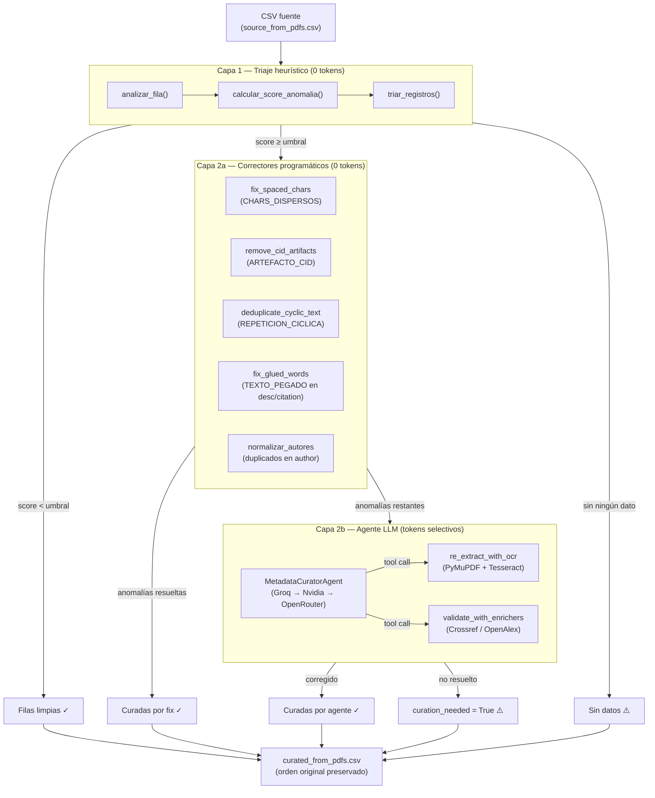
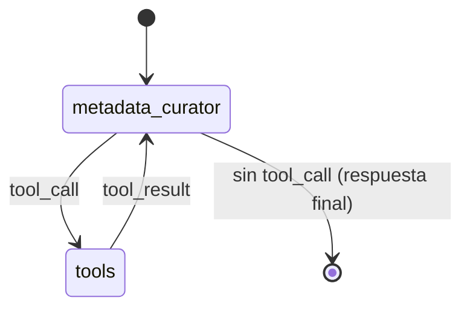

# Pipeline de Curación de Metadatos PDF

## Resumen

El pipeline de curación detecta y corrige metadatos malformados en el CSV generado por el extractor de PDFs (`PDFIngest`), antes de que el pipeline continúe con el `CrosswalkDedupSubgraph`.

Opera en **3 capas** diseñadas para minimizar el costo de tokens LLM: la detección heurística (sin tokens) filtra las filas que realmente necesitan atención, los correctores programáticos (deterministas, sin tokens) resuelven los casos triviales, y el agente LLM solo interviene en lo que no pudo corregirse automáticamente.

---

## Arquitectura de 3 capas



---

## Capa 1: Triaje heurístico

**Módulo:** [`core/utils/heuristic_detectors.py`](../core/utils/heuristic_detectors.py)  
**Costo:** 0 tokens LLM  
**Función principal:** `triar_registros(registros, umbral)`

### Tipos de anomalías detectables

| Tipo | Función | Descripción | Peso en score |
|------|---------|-------------|--------------|
| `CHARS_DISPERSOS` | `detectar_chars_dispersos()` | >60% de tokens tienen longitud 1 (ej. `"E s t i m a r"`) | **0.9** |
| `REPETICION_CICLICA` | `detectar_repeticion_ciclica()` | Subcadena ≥15 chars repetida ≥3 veces | **0.8** |
| `CHARS_CONTROL` | `detectar_chars_control()` | Caracteres de control/no imprimibles (corrupción binaria) | **0.7** |
| `CAMPO_VACIO` | — | Campo obligatorio (`title`, `author`, `type`) sin valor | **0.6** |
| `ARTEFACTO_CID` | `detectar_artefactos_cid()` | Marcadores internos de PDF del tipo `(cid:27)` | **0.5** |
| `TEXTO_PEGADO` | `detectar_texto_pegado()` | >15% de tokens superan 30 caracteres (palabras fusionadas) | **0.4** |
| `LONGITUD_ANOMALA` | `detectar_longitud_anomala()` | z-score > 3.0 respecto a la distribución del lote | **0.35** |

### Scoring y umbral

El score de una fila se calcula sumando los pesos de todas las anomalías detectadas en todos sus campos, con cap en 1.0:

```
score = min(Σ peso(anomalía_ij), 1.0)
```

Solo las filas con `score ≥ CURATION_ANOMALY_THRESHOLD` (default: `0.3`) pasan a las capas siguientes. Todas las demás se marcan como limpias.

### Estadísticas del lote

Para el detector `LONGITUD_ANOMALA`, se calcula la media y desviación estándar de cada campo **sobre el lote completo**, permitiendo detectar outliers relativos (ej. una `citation` de 1500 chars cuando las demás tienen ~80).

### Salida del triaje

```python
limpias, sospechosas, sin_datos = triar_registros(registros, umbral=0.3)
```

Las filas sospechosas reciben metadatos internos de curación:

```json
{
  "id": "39-jaiio-ast-06.pdf-PDFA.pdf",
  "title": "E s t i m * a A c g u i s ...",
  "_curation": {
    "anomalias": {
      "title": ["CHARS_DISPERSOS"],
      "date": ["CAMPO_VACIO"]
    },
    "score": 0.9
  }
}
```

---

## Capa 2a: Correctores programáticos

**Módulo:** [`core/utils/text_fixers.py`](../core/utils/text_fixers.py)  
**Costo:** 0 tokens LLM  
**Función principal:** `aplicar_correctores_programaticos(fila, anomalias_por_campo)`

Se aplican **antes** del agente LLM para reducir al mínimo el trabajo del modelo.

### Correctores disponibles

#### `fix_spaced_chars(texto)` — CHARS_DISPERSOS

Colapsa texto con caracteres separados por espacios individuales. Detecta transiciones entre tokens de longitud 1 y palabras normales para reconstruir las palabras.

```
"E s t i m a r  T e x t u r a s" → "Estimar Texturas"
```

**Aplica en:** todos los campos con CHARS_DISPERSOS.

---

#### `remove_cid_artifacts(texto)` — ARTEFACTO_CID

Reemplaza marcadores `(cid:XX)` por su equivalente Unicode según el mapa interno `_CID_MAP`. Los códigos sin mapeo se eliminan.

```
"di(cid:27)erent criterions" → "different criterions"
```

**Mapa parcial:** códigos 11-15 (ligaturas ff/fi/fl/ffi/ffl), 23 (guión em), 27-31 (variantes), 32 (espacio).

---

#### `deduplicate_cyclic_text(texto)` — REPETICION_CICLICA

Detecta y colapsa subcadenas repetidas en ciclo, preservando la primera ocurrencia completa.

```
"CONICET, Buenos Aires – CONICET, Buenos Aires – CONICET, Buenos Aires"
→ "CONICET, Buenos Aires"
```

---

#### `fix_glued_words(texto)` — TEXTO_PEGADO

Inserta espacios en transiciones CamelCase accidental y dígito↔letra. Solo heurístico; no realiza segmentación lingüística completa.

```
"LaTransformadaDiscretadeKarhunen" → "La Transformada Discretade Karhunen"
```

> **Restricción:** Solo se aplica en campos `description` y `citation`. En `title` y `author`, el riesgo de fragmentar nombres propios correctamente pegados es demasiado alto.

---

#### `normalizar_autores(texto)` — autores duplicados

Elimina autores repetidos en la cadena de autores separada por `|`, preservando el orden de aparición. Comparación normalizada Unicode (NFKD).

```
"Andrea Silvetti|Claudio Delrieux|Andrea Silvetti" → "Andrea Silvetti|Claudio Delrieux"
```

> Se aplica **siempre** sobre el campo `author`, independientemente de si tiene anomalía detectada.

---

### Re-verificación de anomalías residuales

Después de aplicar los correctores, [`_calcular_anomalias_restantes()`](../core/nodes/curation_nodes.py) re-ejecuta los detectores heurísticos sobre los campos corregidos para determinar cuáles anomalías persisten. Solo las filas con anomalías restantes pasan al agente LLM.

```python
# Decisión de routing después de correctores:
if anomalias_restantes:
    → enviar al agente LLM (Capa 2b)
else:
    → marcar como curada (fin del pipeline para esta fila)
```

**Casos que siempre van al agente:**
- `CAMPO_VACIO`: los correctores no pueden inventar datos.
- `CHARS_DISPERSOS` residual: si `fix_spaced_chars` no reconstituyó texto inteligible.
- Cualquier anomalía sin corrector programático asociado.

---

## Capa 2b: Agente curador LLM

**Módulo:** [`core/agent/metadata_curator_agent.py`](../core/agent/metadata_curator_agent.py)  
**Costo:** tokens selectivos (solo filas con anomalías irresolubles)  
**Modelo:** fallback automático Groq → Nvidia NIM → OpenRouter

### Selección de proveedor LLM

El agente usa `_construir_modelo_curador()` que selecciona el primer proveedor disponible según las API keys configuradas:

| Prioridad | Proveedor | Configuración |
|-----------|-----------|---------------|
| 1 | **Groq** | `GROQ_API_KEY` |
| 2 | **Nvidia NIM** | `NVIDIA_API_KEY` (modelo: `meta/llama-3.3-70b-instruct`) |
| 3 | **OpenRouter** | `OPEN_ROUTER_API_KEY` |

### Grafo del agente (ReAct)



El agente sigue el patrón **ReAct**: puede llamar herramientas en bucle (máximo `recursion_limit=15`) y decide cuándo terminar.

### Tools disponibles

#### `re_extract_with_ocr(pdf_path)`

Re-extrae el PDF habilitando OCR. Estrategia de dos pasos:

1. **PyMuPDF** con extracción por bloques (preserva el layout).
2. **Tesseract** (fallback) si PyMuPDF no produce texto legible.

**Cuándo usarla:** `CHARS_DISPERSOS` o `TEXTO_PEGADO` grave irrecuperable programáticamente, siempre que el PDF esté disponible localmente.

**Cuándo NO usarla:** si el PDF no está disponible, o si los identificadores del ítem permiten obtener los metadatos desde una fuente autoritativa.

```json
{
  "texto_extraido": "Estimación de Texturas Locales en Imágenes...",
  "ocr_applied": true,
  "metodo": "tesseract_ocr"
}
```

---

#### `validate_with_enrichers(strategy, doi, issn, title)`

Consulta fuentes bibliográficas externas para obtener metadatos autoritativos.

| Estrategia | Fuente | Cuándo usar |
|------------|--------|-------------|
| `"by_doi"` | Crossref → fallback DOI Negotiation | DOI limpio y legible |
| `"by_issn"` | OpenAlex | ISSN disponible, sin DOI |
| `"by_title"` | OpenAlex | Título legible, baja confianza |

**Restricciones del agente:**
- NO llamar si los identificadores también están corruptos.
- NO llamar más de una vez por registro.

```json
{
  "found": true,
  "strategy": "crossref_doi",
  "data": {
    "title": "Estimación de Texturas Locales...",
    "date": "2022",
    "author": "Juan Pablo García|Miguel Fernández"
  }
}
```

### Formato de entrada al agente

El agente recibe un `HumanMessage` con las filas sospechosas en JSON compacto. Solo se incluyen campos con valor (excepto `id`, `_curation`, `_corrections_applied`):

```json
[
  {
    "id": "39-jaiio-ast-06.pdf-PDFA.pdf",
    "title": "E s t i m * a A c g u i s ...",
    "author": "Juan Pablo|Miguel María Elena|Gustavo C. Pilar",
    "type": "objeto de conferencia",
    "subject": "Ciencias físicas",
    "citation": "Asociación Argentina de Astronomía",
    "_curation": {
      "anomalias": {
        "title": ["CHARS_DISPERSOS"],
        "date": ["CAMPO_VACIO"],
        "description": ["CAMPO_VACIO"]
      },
      "score": 0.9
    },
    "_corrections_applied": ["title:CHARS_DISPERSOS"]
  }
]
```

### Formato de salida del agente

El agente devuelve un JSON con solo los campos que modificó:

```json
[
  {
    "id": "39-jaiio-ast-06.pdf-PDFA.pdf",
    "title": "Estimación Adquisición de Código de Complejidad de Texturas Locales",
    "date_curation_needed": true,
    "description_curation_needed": true,
    "correction_notes": "Título reconstruido vía validate_with_enrichers(by_issn). Campos date y description sin datos autoritativos disponibles; marcados para revisión manual."
  }
]
```

### Principios conservadores del agente

El agente está diseñado con un sesgo deliberado hacia la **no-intervención**:

- **NO inventa metadatos.** Si no puede corregir con certeza, marca como `curation_needed`.
- **NO sobreescribe** campos parcialmente válidos con datos de la API si no hay coincidencia clara.
- **Prefiere** dejar un campo para revisión humana antes que introducir errores.
- **NO modifica** el campo `id` bajo ninguna circunstancia.
- **Incluye siempre** `correction_notes` explicando qué hizo.

---

## Salida del pipeline

El nodo `curate_metadata_node` ensambla todos los registros en un único CSV, preservando el orden original del lote:

```
curated_from_pdfs.csv
├── Filas limpias          (sin modificación)
├── Curadas por fix        (solo correcciones programáticas)
├── Curadas por agente     (correcciones LLM; sin campos marcados)
├── Marcadas para revisión (curation_needed=True + correction_notes)
└── Sin datos              (filas completamente vacías, se pasan tal cual)
```

El CSV original (`source_from_pdfs.csv`) **nunca se sobreescribe**.

### Estadísticas de curación

El nodo retorna un dict `curation_stats` con contadores por categoría:

```python
{
    "total": 10,
    "limpias": 4,
    "sospechosas_detectadas": 6,
    "sin_datos": 0,
    "curadas_programatico": 3,    # resueltas por text_fixers
    "curadas_agente": 2,          # resueltas por el LLM
    "marcadas_revision": 1,       # LLM no pudo resolver
    "errores": 0,                 # errores de invocación del agente
}
```

---

## Ejemplos reales del bucket `importacion-jaio`

Los siguientes son los casos de anomalías observados al procesar los 10 PDFs del 39 JAIIO:

### ast-04: TEXTO_PEGADO en description

**Campo original:**
```
LaTransformadaDiscretadeKarhunen-Lo`eve(TDKL)esla transformadáoptima(enunaestadísticadesegundoorden)...
```

**Corrector aplicado:** `fix_glued_words()` en `description`  
**Resultado parcial:** `La Transformada Discreta de Karhunen-Lo`eve (TDKL)es la transformadá optima...`  
**Acción del agente:** si persiste TEXTO_PEGADO, el agente puede usar `re_extract_with_ocr` o marcar para revisión.

---

### ast-06: CHARS_DISPERSOS en title + CAMPO_VACIO

**Campo original:**
```
E s t i m * a A c g u i s á t n in M d a e ilin l g a C o d m e p T l e e x j i t d u a r d a s L o ...
```

**Score:** 0.9 (CHARS_DISPERSOS peso 0.9)  
**Corrector aplicado:** `fix_spaced_chars()` → colapsa los caracteres dispersos  
**Resultado:** texto colapsado; puede ser inteligible o ininteligible según el patrón de dispersión  
**Acción del agente:** si el resultado no es legible, usa `validate_with_enrichers()` con ISSN si está disponible, o marca `title_curation_needed=True`

---

### ast-09: CAMPO_VACIO en date

**ISSN disponible:** `1850-2806`  
**Acción del agente:** puede llamar `validate_with_enrichers(strategy="by_issn", issn="1850-2806")` para obtener el año de publicación desde OpenAlex.

---

### ast-10: TEXTO_PEGADO grave en description + CAMPO_VACIO en date

**Campo original:**
```
EnelmarcodelfiltradoBayesiano,sepresentaunmodeloen elcualelprocesodemediciónyelestadosiguientesoncon...
```

**Score combinado:** >0.3 por TEXTO_PEGADO + CAMPO_VACIO  
**Correctores aplicados:** `fix_glued_words()` + `_calcular_anomalias_restantes()`  
**Acción del agente:** si TEXTO_PEGADO persiste en description, el agente intenta re-extractar con OCR o marca para revisión.

---

## Configuración

| Variable | Descripción | Valor default |
|----------|-------------|---------------|
| `CURATION_ANOMALY_THRESHOLD` | Score mínimo para enviar fila al agente | `0.3` |
| `METADATA_CURATOR_MODEL` | Modelo LLM del agente curador | `openai/gpt-oss-20b` |
| `GROQ_API_KEY` | API key de Groq (prioridad 1) | — |
| `NVIDIA_API_KEY` | API key de Nvidia NIM (prioridad 2) | — |
| `OPEN_ROUTER_API_KEY` | API key de OpenRouter (prioridad 3) | — |

---

## Archivos clave

| Archivo | Rol |
|---------|-----|
| [`core/nodes/curation_nodes.py`](../core/nodes/curation_nodes.py) | Nodo orquestador; coordina las 3 capas |
| [`core/utils/heuristic_detectors.py`](../core/utils/heuristic_detectors.py) | Capa 1: detección heurística |
| [`core/utils/text_fixers.py`](../core/utils/text_fixers.py) | Capa 2a: correctores programáticos |
| [`core/agent/metadata_curator_agent.py`](../core/agent/metadata_curator_agent.py) | Capa 2b: agente LLM con tools |
| [`agent_prompts/metadata_curator_agent.md`](../agent_prompts/metadata_curator_agent.md) | Prompt del sistema del agente |
| [`tests/integration/test_metadata_curator_agent.py`](../tests/integration/test_metadata_curator_agent.py) | Tests de integración del agente |
