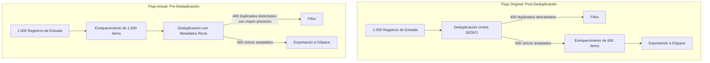
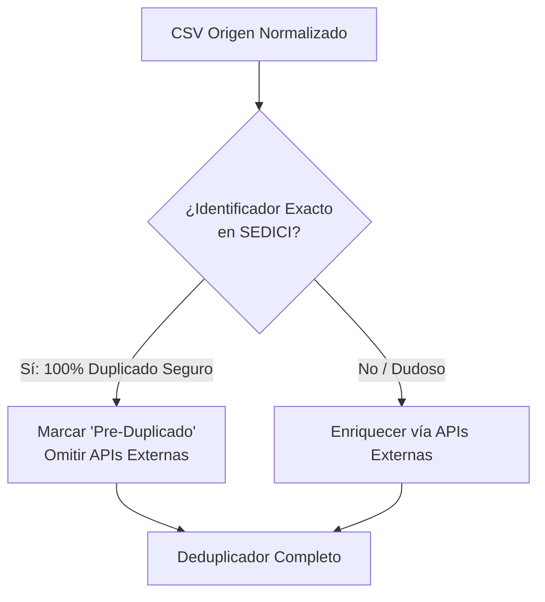
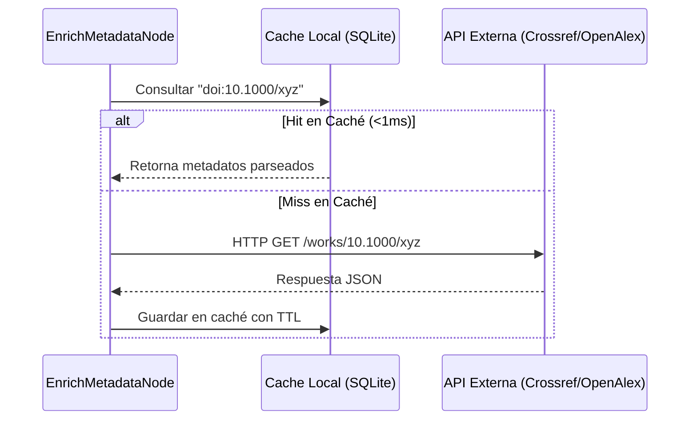

# Estrategias de Optimización para el Enriquecimiento de Metadatos Pre-Deduplicación

## 1. Contexto y Planteo de la Problemática

En el pipeline de importación masiva (*Bulk Importation Workflow*) hacia SEDICI / DSpace, la ubicación del enriquecimiento de metadatos (**`EnrichmentSubgraph`**) con anterioridad a la deduplicación (**`Deduplicate`**) proporciona una ventaja analítica sustancial: **permite que el deduplicador compare registros con la mayor cantidad de atributos canónicos completos posible** (título normalizado, autores limpios, DOI, ISSN, año de publicación, editorial/revista).

Sin embargo, trasladar el enriquecimiento antes de la deduplicación introduce un dilema de eficiencia y consumo de recursos externos:



### Principales Desafíos Identificados:
1. **Llamadas redundantes a APIs externas:** Se consultan servicios como Crossref, OpenAlex, DataCite y OpenLibrary para ítems que finalmente resultarán ser duplicados exactos ya presentes en el repositorio institucional.
2. **Latencia y tiempos de ejecución del lote:** Si el enriquecimiento se ejecuta de manera secuencial (registro por registro), un lote mediano de 1.000 a 3.000 documentos con múltiples llamadas HTTP por ítem (DOI, ISSN, título como fallback) puede demorar varios minutos o incluso horas.
3. **Límites de tasa (Rate Limiting) y cuotas de servicio:**
   - **Crossref:** A través del *polite pool* (enviando `mailto` en el `User-Agent`), tolera hasta ~50 req/s, pero bloquea ante ráfagas descontroladas.
   - **OpenAlex:** Permite hasta 10 req/s con autenticación/email.
   - **DOI Negotiation:** Depende de múltiples servidores de editoriales (ScienceDirect, Springer, Wiley, Zenodo), varios de los cuales imponen bloqueos por IP temporales ante scraping intensivo.
4. **Resilencia ante fallos transitorios:** Errores `502 Bad Gateway`, `429 Too Many Requests` o *timeouts* en servidores externos pueden ralentizar o pausar el flujo de importación masiva.

---

## 2. Análisis Profundo de Posibles Soluciones

A continuación se detallan cuatro estrategias de optimización arquitectónica y operativa diseñadas específicamente para el pipeline de importación masiva.

---

### Solución A: Pre-filtro Rápido de Duplicados Evidentes (*Fast Pre-filter*)

#### Concepto
Antes de someter el lote completo a las llamadas HTTP de enriquecimiento, se ejecuta un cribado preliminar en memoria (o vía índice local en Pandas/SQLite) que contrasta únicamente identificadores inequívocos y deterministas entre el CSV origen y el export de SEDICI (`generic_sedici.csv` o `repository_csv_path`).

#### Mecanismo de Identificación
- **Coincidencia 1 (DOI exacto normalizado):** Si `doi_source.lower().strip() == doi_sedici.lower().strip()`.
- **Coincidencia 2 (URI/Handle idéntico):** Si el handle o identificador de origen ya está registrado.
- **Coincidencia 3 (Fingerprint estricto de Título + Año):** Coincidencia del 100% de similitud en el título normalizado (sin signos, minúsculas) y año de publicación idéntico.



#### Ventajas y Desventajas
- **Ventajas:** Ahorra de forma inmediata entre el 30% y 60% de las llamadas a APIs externas en lotes con alto solapamiento institucional, sin pérdida de precisión.
- **Desventajas:** Requiere normalización estricta previa para evitar falsos positivos en el pre-filtro (un ítem con un título similar pero diferente autor no debe ser descartado prematuramente).

---

### Solución B: Enriquecimiento Selectivo o Condicional (*Sparse Enrichment*)

#### Concepto
No todos los registros de entrada necesitan ser enriquecidos. Si un documento ya cuenta con un nivel de completitud de metadatos suficiente para que el algoritmo del deduplicador funcione con máxima confianza, no tiene sentido demorar el pipeline consultando servicios externos.

#### Criterio de Madurez del Registro (*Completeness Threshold*)
Se clasifica cada registro del CSV genérico antes de llamar a los enriquecedores:

1. **Nivel Oro (Completo - Se omite enriquecimiento):**
   - Posee `title` no nulo (longitud > 15 caracteres).
   - Posee `author` con separadores válidos.
   - Posee `date` (año de 4 dígitos).
   - Posee `doi` válido (o `issn` + `citation`).
   - *Acción:* Pasa directamente al deduplicador sin llamadas de red.
2. **Nivel Plata (Parcial - Enriquecimiento enfocado):**
   - Posee `doi`, pero le falta `author` o `date`.
   - *Acción:* Consulta dirigida exclusivamente a Crossref (`enrich_by_doi`) para rellenar campos faltantes.
3. **Nivel Bronce (Incompleto / Débil - Búsqueda heurística):**
   - Carece de `doi` y de `author`. Solo posee `title` o `issn`.
   - *Acción:* Se habilita la búsqueda en OpenAlex por ISSN o por título, respetando un límite de confianza estricto.

#### Ventajas y Desventajas
- **Ventajas:** Reduce drásticamente las consultas en repositorios ya estandarizados (como fuentes que ya traían DOI y autores limpios).
- **Desventajas:** Si la fuente original tiene datos de baja calidad o nombres mal formateados, confiar en ellos sin validar contra Crossref podría perder la oportunidad de normalizar autores.

---

### Solución C: Sistema de Caché Persistente Local (*Persistent Enrichment Cache*)

#### Concepto
Implementar un almacén clave-valor persistente local (por ejemplo, SQLite o LMDB ubicado en `runs/.cache/enrichment_cache.db`) que registre las respuestas parseadas de Crossref, OpenAlex y OpenLibrary.

#### Estructura de la Base de Datos de Caché
```sql
CREATE TABLE IF NOT EXISTS enrichment_cache (
    query_key TEXT PRIMARY KEY,        -- ej: "doi:10.1016/j.cell.2020.01.001" o "issn:0028-0836"
    provider TEXT NOT NULL,            -- "Crossref", "OpenAlex", "OpenLibrary"
    data_json TEXT NOT NULL,           -- Payload normalizado en JSON
    updated_at TIMESTAMP DEFAULT CURRENT_TIMESTAMP,
    ttl_days INTEGER DEFAULT 90        -- Validez de los metadatos
);
CREATE INDEX IF NOT EXISTS idx_query_key ON enrichment_cache(query_key);
```



#### Ventajas y Desventajas
- **Ventajas:**
  - En pruebas locales, desarrollos sucesivos y re-ejecuciones de grafos en LangGraph Studio, el tiempo de enriquecimiento de lotes ya vistos pasa de minutos a **cero segundos**.
  - Si dos lotes sucesivos de distintos departamentos de la universidad comparten citas o publicaciones en las mismas revistas (mismo ISSN), el enriquecimiento es instantáneo.
- **Desventajas:** Requiere mantenimiento mínimo de tamaño de base de datos (invalidador o políticas de retención con TTL).

---

### Solución D: Asincronismo Concurrente con Semáforo (*Async Batching & Rate Limiting*)

#### Concepto
El nodo actual `enrich_metadata_node` procesa el CSV mediante una iteración secuencial síncrona:
```python
for idx, row in df.iterrows():
    extra = _enrich_row(...)
```
Al transformar este procesamiento en tareas concurrentes con `httpx.AsyncClient` o ejecutores en hilo con `asyncio.Semaphore`, se optimiza el throughput de red sin vulnerar las políticas de uso de los proveedores.

#### Parámetros Recomendados:
- Concurrencia máxima global: **5 a 10 trabajadores simultáneos**.
- Tasa máxima para Crossref Polite: **30 req/segundo**.
- Tasa máxima para OpenAlex: **8 req/segundo**.

#### Comparativa de Tiempo Estimado para 1.000 Ítems:
| Esquema de Ejecución | Latencia Promedio por Request | Tiempo Total Estimado |
| :--- | :--- | :--- |
| **Secuencial Síncrono (Actual)** | 250 ms | ~4.1 minutos |
| **Concurrente (5 workers)** | 250 ms | ~50 segundos |
| **Concurrente (10 workers)** | 250 ms | ~25 segundos |
| **Concurrente + Caché (50% Hit)** | 250 ms / 0.5 ms | ~12 segundos |

---

## 3. Matriz Comparativa y Recomendación de Implementación Futura

| Estrategia | Esfuerzo de Desarrollo | Impacto en Latencia | Ahorro de Cuota de Red | Complejidad Arquitectónica |
| :--- | :---: | :---: | :---: | :---: |
| **A. Pre-filtro Rápido** | Medio | Alto (30-60%) | Alto (30-60%) | Baja (Pandas en memoria) |
| **B. Enriquecimiento Selectivo** | Bajo | Muy Alto | Muy Alto | Muy Baja (condicional de campos) |
| **C. Caché Persistente SQLite** | Bajo-Medio | Extremo (en re-ejecuciones) | Extremo | Baja (archivo único SQLite) |
| **D. Concurrencia Asíncrona** | Medio | Muy Alto (5x a 10x) | Neutro (mismas peticiones, menor tiempo) | Media (asyncio / httpx) |

### Hoja de Ruta Sugerida para Futuras Etapas:
1. **Fase 1 (Inmediata):** Habilitar el **Enriquecimiento Selectivo (B)** para no solicitar APIs si el ítem ya cuenta con DOI, autor, año y título.
2. **Fase 2:** Incorporar la **Caché Local SQLite (C)** para brindar persistencia entre ejecuciones de desarrollo y producción.
3. **Fase 3:** Implementar el **Pre-filtro Rápido (A)** y la **Concurrencia con Semáforo (D)** para optimizar lotes masivos de decenas de miles de registros.
