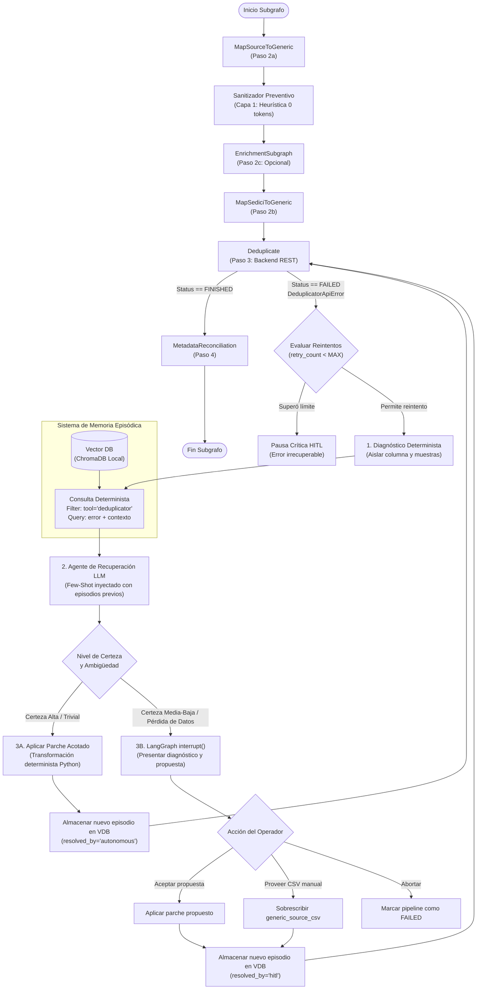

# Arquitectura Híbrida de Recuperación de Errores y Memoria Episódica

> **Contexto:** Este documento describe la arquitectura para la detección, prevención y recuperación dinámica de errores en el pipeline de importación masiva de metadatos (específicamente en el subgrafo `CrosswalkDedupSubgraph`), integrando **Memoria Episódica** (*Case-Based Reasoning*) sobre bases de datos vectoriales. Sirve como base teórica y técnica para el desarrollo y la posterior redacción de la tesis de grado.

---

## 1. Motivación y Causa Raíz (Estudio del Caso Issue #34)

Durante la ejecución del pipeline sobre lotes de metadatos reales (repositorio UNLP/DOAJ, Scopus, etc.), el servicio de deduplicación reportó anomalías en la comparación temporal:

```text
WARNING deduplicator.core.comparator:35 
Error al comparar fechas: 1999, June — invalid literal for int() with base 10: 'June'
```

### Factores Determinantes del Problema
1. **Heterogeneidad de Fuentes:** Los CSVs provistos por diferentes editoriales o repositorios expresan fechas en formatos naturales no estandarizados (`"1999, June"`, `"June-July"`, `"Primavera 2004"`, `"s/f"`).
2. **Limitaciones del Motor de Crosswalk:** El motor de mapeo actual (`core/scripts/crosswalk`) opera mediante transformaciones sintácticas elementales (`trim`, `lowercase`). Carece de capacidad para realizar normalización semántica de fechas (por ejemplo, extraer el año o mapear nombres de meses a formato ISO `YYYY-MM`).
3. **Contrato Estricto del Backend de Deduplicación:** El comparador del deduplicador calcula distancias matemáticas entre años. Si una fecha no es parseable como entero o estándar numérico, la comparación falla. Actualmente emite una advertencia (`WARNING`) ignorando el campo, pero si la validación se endurece para evitar falsos negativos, el job aborta con error.
4. **Propagación en Cascada:** Un dato malformado que atraviesa la deduplicación sin normalizarse contamina la etapa de reconciliación (`MetadataReconciliation`) y el mapeo final a SEDICI (`MapToSediciFormat`), arriesgando el rechazo del paquete SAF al momento de la importación final en DSpace.

---

## 2. El Dilema Arquitectónico: Determinismo vs. Adaptabilidad Dinámica

La incorporación de modelos de lenguaje (LLMs) para solucionar errores en caliente plantea un compromiso clásico de diseño:

* **Enfoque Puramente Determinista (Reglas duras):**
  * *Ventajas:* Ejecución veloz, costo cero de inferencia, 100% auditable y reproducible.
  * *Desventajas:* Frágil ante la variabilidad infinita de datos en repositorios abiertos. Cada nuevo patrón no contemplado aborta el pipeline y exige intervención del programador para codificar una nueva regla.
* **Enfoque Puramente Agéntico (ReAct / Sandbox de Código libre):**
  * *Ventajas:* Alta adaptabilidad teórica ante cualquier tipo de error imprevisto.
  * *Desventajas:* Riesgo crítico con LLMs de tamaño mediano ($\le 120\text{B}$). Un modelo generando código Python desatendido sobre DataFrames de miles de filas puede corromper identificadores, alterar tipos de datos, descartar columnas o entrar en bucles infinitos de reintentos costosos.

### La Solución: Arquitectura Híbrida de "Defensa en Profundidad"

La arquitectura propuesta adopta el principio de **Defensa en Profundidad**:
1. **Capa 1: Prevención Temprana Determinista (Pre-Deduplicador):** Normalizadores heurísticos rápidos resuelven el 95% de los casos comunes (0 tokens de LLM).
2. **Capa 2: Ejecución del Servicio (Happy Path):** El deduplicador corre normalmente.
3. **Capa 3: Recuperación Reactiva con Memoria Episódica (Post-Fallo):** Si el backend falla por una anomalía imprevista, un agente especialista consulta casos históricos idénticos o análogos en una base vectorial sin consumir tokens de búsqueda, formula una corrección acotada y decide si autorreparar o solicitar validación humana (*Human-in-the-Loop*).

---

## 3. Topología de la Arquitectura Híbrida

A continuación se detalla el flujo de control y datos en el subgrafo `CrosswalkDedupSubgraph`:



---

## 4. Memoria Episódica (*Case-Based Reasoning*)

El Razonamiento Basado en Casos (CBR) postula que los problemas nuevos suelen ser variaciones de problemas ya resueltos. En lugar de ajustar los pesos del modelo (*fine-tuning*) o compilar cientos de reglas estáticas en código fuente, el sistema registra cada resolución exitosa como un **episodio cognitivo**.

### 4.1. Esquema del Documento de Memoria (Episodio)

Cada entrada en la base de datos vectorial se desacopla rigurosamente en tres capas:

```json
{
  "id": "ep_dedup_20260925_001",
  "metadata": {
    "tool": "deduplicator",
    "source_name": "unlp_doaj",
    "error_class": "ValueError",
    "affected_column": "date",
    "resolved_by": "autonomous",
    "timestamp": "2026-09-25T11:00:00Z"
  },
  "embedding_content": "Tool: deduplicator. Error: Error al comparar fechas: 1999, June — invalid literal for int() with base 10: 'June'. Column: date. Sample: '1999, June'",
  "payload": {
    "error_summary": "La columna 'date' contenía meses en inglés que impiden la comparación numérica.",
    "culprit_sample": "1999, June",
    "transformation_strategy": "value_mapping",
    "solution_applied": {
      "type": "month_name_to_iso",
      "mapping": { "June": "06" },
      "output_format": "YYYY-MM"
    },
    "reasoning": "Se extrajo el año y se mapeó el nombre textual del mes a su representación de dos dígitos ISO 8601."
  }
}
```

### 4.2. Recuperación Determinista sin LLM (Zero-LLM Retrieval)

Para garantizar latencia mínima, costo cero y eliminar el riesgo de consultas mal formuladas, el proceso de búsqueda en la memoria vectorial **no utiliza ningún LLM**:

1. **Extracción Sintáctica de la Falla:**
   Al capturarse la excepción `DeduplicatorApiError(msg)`, un analizador en Python puro extrae:
   - La clase de error (`ValueError`, `KeyError`, etc.).
   - Literales citados mediante expresiones regulares (`'June'`, `'1999, June'`).
2. **Escaneo de la Columna Afectada:**
   Se inspeccionan las primeras filas del archivo `generic_source.csv`. La columna que contiene el literal extraído se identifica de inmediato (`affected_column = "date"`).
3. **Construcción Determinista del Texto de Búsqueda:**
   ```python
   query_text = (
       f"Tool: deduplicator. "
       f"Error: {error_msg}. "
       f"Column: {affected_column}. "
       f"Sample: {sample_token}"
   )
   ```
4. **Filtrado Jerárquico en la Base Vectorial:**
   * **Nivel 1 (Filtro Duro):** `{"tool": "deduplicator"}`. Impide que errores de sintaxis de crosswalk o fallas de OCR contaminen el contexto.
   * **Nivel 2 (Filtro Específico / Soft Boost):** Se intenta consultar priorizando `source_name == state["source_name"]` para reutilizar convenciones particulares de esa editorial.
   * **Nivel 3 (Fallback Global):** Si la similitud coseno no supera el umbral $\tau = 0.75$, se consulta sobre el catálogo general de `deduplicator`.

---

## 5. El Agente de Recuperación y la Interrupción Humana (HITL)

### 5.1. Inyección de Contexto en el Prompt (Few-Shot)

El agente recibe los casos recuperados directamente en su mensaje de sistema:

```markdown
Eres el Agente Especialista en Recuperación de Errores de Metadatos del Deduplicador.
Ocurrió una falla durante la deduplicación del lote:
- Error original: "Error al comparar fechas: 1999, June — invalid literal for int() with base 10: 'June'"
- Columna comprometida: "date"
- Valores muestra afectados: ["1999, June", "1998, June"]

--- CASOS PREVIOS RESUELTOS EXITOSAMENTE (MEMORIA EPISÓDICA) ---
[Caso #1 (Similitud: 94%)]
- Problema: Mes en inglés en columna date ("2001, July").
- Estrategia: "month_name_to_iso" -> {"July": "07"}.
- Resultado: Deduplicación completada con éxito.

--- INSTRUCCIONES OPERATIVAS ---
1. Si el patrón coincide inequívocamente con el Caso #1, genera una respuesta con estrategia de corrección determinista.
2. Si el caso presenta ambigüedad (por ejemplo, rango "June-July" o fecha inexistente "s/f"), marca "confidence": "low" y describe la propuesta para validación humana.
```

### 5.2. Herramientas Seguras del Agente (Sin Sandbox Libre)

El modelo **no escribe código Python arbitrario**. Sus herramientas son parametrizadas y ejecutadas por funciones seguras y auditadas:

* `apply_value_mapping(column, mapping_dict)`: Reemplaza cadenas textuales exactas en la columna indicada.
* `apply_regex_extraction(column, regex_pattern, group_index)`: Extrae componentes como años de 4 dígitos (`r"\b(19\d\d|20\d\d)\b"`).
* `apply_date_parser_iso(column, fallback_action)`: Utiliza librerías robustas (`python-dateutil`) para llevar cadenas heterogéneas a estándar ISO `YYYY-MM-DD` o `YYYY`.
* `validate_csv_integrity(original_csv, patched_csv)`: Asegura que no se hayan modificado IDs primarios, ni eliminado filas inadvertidamente.

### 5.3. Interrupción con LangGraph `interrupt()`

Si el agente evalúa que la corrección implica pérdida de información o incertidumbre, invoca la interrupción nativa de LangGraph:

```python
interrupt({
    "action_required": "dedup_error_review",
    "error_type": "DEDUPLICATION_FAILURE",
    "observation": error_message,
    "affected_column": affected_column,
    "offending_samples": samples,
    "proposed_fix": {
        "strategy": "value_mapping",
        "description": "Convertir meses de texto en inglés a formato numérico ISO (YYYY-MM)",
        "mapping": {"June": "06"}
    },
    "options": [
        {"id": "accept_proposal", "label": "Aceptar y aplicar propuesta del agente"},
        {"id": "provide_manual_csv", "label": "Proveer ruta de CSV corregido manualmente"},
        {"id": "abort", "label": "Cancelar importación del lote"}
    ]
})
```

Al reanudar mediante `Command(resume=...)`, el pipeline procesa la elección humana y **guarda el nuevo episodio en la base vectorial**, capitalizando la intervención del operador para que la falla nunca más requiera atención manual.

---

## 6. Comparativa de Enfoques de Búsqueda y Almacenamiento

| Dimensión | Enfoque 1: Filtrado Jerárquico + Similitud Densa (Elegido) | Enfoque 2: Búsqueda Híbrida (Dense + BM25) | Enfoque 3: Hash de Excepción + Fallback |
| :--- | :--- | :--- | :--- |
| **Mecanismo de Consulta** | Metadata filtering estricto + Coseno sobre embedding denso. | Reciprocal Rank Fusion (BM25 para excepción + Vector para contexto). | Clave/Valor exacta sobre firma sintáctica; vector solo si falla. |
| **Complejidad de Infraestructura** | Mínima (ChromaDB o Qdrant local embebido en `.venv`). | Media (requiere mantener índice léxico y pesos de fusión). | Media (requiere módulo de normalización de firmas AST). |
| **Robustez ante Errores Nuevos**| Muy alta (comprende similitud conceptual de anomalías). | Muy alta (fuerte en tokens de error idénticos). | Baja en el fast-path; alta únicamente en el fallback. |
| **Latencia de Búsqueda** | $\approx 10-25$ ms. | $\approx 30-50$ ms. | $< 1$ ms para aciertos de hash; $\approx 25$ ms en fallback. |
| **Alineación con Tesis** | **Excelente:** Elegante, formalmente defendible y libre de sobrecarga. | Buena: Añade complejidad matemática sin ganancia crítica en datasets de metadatos. | Regular: Tiende a convertirse en un catálogo de reglas rígidas encubierto. |

---

## 7. Propagación de Correcciones y Consistencia de Estado

Un desafío crucial detectado en el análisis es evitar que las correcciones realizadas sobre `generic_source.csv` para destrabar la deduplicación se pierdan en etapas posteriores.

Para resolverlo, el `State` mantiene un registro formal de mutaciones aplicadas:
```python
state["applied_corrections"] = [
    {
        "stage": "post_dedup_recovery",
        "column": "date",
        "target": "source_and_generic",
        "transformation": {"June": "06"},
        "affected_ids": ["14531", "14532"]
    }
]
```

Cuando el subgrafo alcanza el Paso 4 ([`MetadataReconciliation`](file:///home/santi/Documentos/LangGraph/Modulo-Marta/core/nodes/reconciliation_node.py)) y el Paso 5 ([`MapToSediciFormat`](file:///home/santi/Documentos/LangGraph/Modulo-Marta/core/nodes/crosswalk_nodes.py)), estos nodos consultan `state["applied_corrections"]` para reflejar las mismas transformaciones sobre el CSV reconciliado y sobre el CSV final `sedici_ready.csv`, asegurando total coherencia en todo el ciclo de vida del dato.
