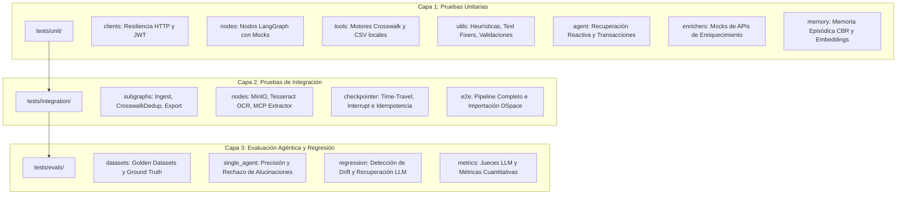

# Suite de Pruebas y Evaluación — Pipeline de Importación Masiva

> **Bulk Importation Workflow to SEDICI / DSpace**  
> Documentación técnica integral de la suite de pruebas automatizadas, pruebas de integración y evaluación agéntica.

---

## 🗺️ Visión General y Arquitectura en 3 Capas

La suite de pruebas del pipeline de importación masiva está estructurada bajo una **pirámide de pruebas pragmática y adaptada a flujos agénticos** con LangGraph. Esta arquitectura desacopla el ciclo de retroalimentación ultrarrápido del desarrollo local de las pruebas de integración con servicios externos y de la evaluación probabilística de modelos LLM:



### Capas del Sistema:
1. **Capa 1: Tests Unitarios (`tests/unit/`)**
   - **Enfoque:** Determinismo matemático, aislamiento absoluto (sin red, sin contenedores, sin LLM real).
   - **Velocidad:** Tiempo total de ejecución < 10 segundos.
   - **Garantía:** Corrección de lógica de negocio pura, validaciones estructurales de esquemas, manipulación de CSVs, transformaciones regex y contratos de clases.
2. **Capa 2: Tests de Integración (`tests/integration/`)**
   - **Enfoque:** Validación de contratos e interoperabilidad entre subsistemas con servicios reales o emulados en Docker (MinIO, microservicio de Crosswalk/Deduplicación, DSpace 7+ Sandbox).
   - **Velocidad:** Tiempo total ~1 a 3 minutos.
   - **Garantía:** Correcta compilación y ejecución de subgrafos de LangGraph, persistencia de hilos con checkpointers, pausa y reanudación ante interrupciones (HITL), y generación válida del paquete SAF (*Simple Archive Format*).
3. **Capa 3: Evaluaciones Agénticas (`tests/evals/`)**
   - **Enfoque:** Medición empírica y probabilística de la calidad de inferencia de modelos LLM (Llama-3, DeepSeek, etc.) sobre prompts de crosswalk, curación y autoreparación.
   - **Aislamiento de CI:** Aislados del pipeline regular de CI/CD para evitar costos de tokens y fragilidad estocástica. Se ejecutan bajo demanda o en pipelines nocturnos.

---

## 🧭 Árbol de Navegación de la Suite

```text
tests/
├── README.md                                 ← (Este archivo) Visión general y guía de la suite
├── unit/                                     ← Tests unitarios rápidos, puros y deterministas (<10s)
│   ├── README.md                             ← Principios, garantías y comandos de unit testing
│   ├── clients/README.md                     ← Contratos HTTP, resiliencia y JWT
│   ├── nodes/README.md                       ← Aislamiento de nodos LangGraph con mocks
│   ├── tools/README.md                       ← Motores locales Crosswalk y CsvHandler
│   ├── utils/README.md                       ← Text fixers, heurísticas y validación temprana
│   ├── agent/README.md                       ← Agente de recuperación reactiva y transacciones
│   ├── enrichers/README.md                   ← Clientes de enriquecimiento (Crossref, OpenAlex, OpenLib)
│   └── memory/README.md                      ← Memoria episódica (CBR) y búsqueda vectorial
├── integration/                              ← Tests de integración con servicios y microservicios
│   ├── README.md                             ← Topología de integración y requisitos Docker
│   ├── subgraphs/README.md                   ← Integración de subgrafos (Ingest, CrosswalkDedup, Export)
│   ├── nodes/README.md                       ← Nodos con MinIO, MCP y Tesseract OCR
│   ├── checkpointer_and_threads/README.md    ← Persistencia, time-travel e interrupciones HITL
│   └── e2e/README.md                         ← Suites completas de extremo a extremo
├── evals/                                    ← Evaluación agéntica cuantitativa y probabilística
│   ├── README.md                             ← Marco de evaluación, métricas y gestión de costos
│   ├── datasets/README.md                    ← Datasets versionados y Ground Truth
│   ├── single_agent/README.md                ← Benchmarks individuales y control de alucinaciones
│   ├── regression/README.md                  ← Detección de schema drift y memoria LLM
│   └── metrics/README.md                     ← Evaluadores heurísticos y jueces LLM
├── fixtures/README.md                        ← Mocks compartidos, sintéticos y conftest.py
├── data/README.md                            ← Datasets estáticos de prueba categorizados por subgrafo
└── studio/README.md                          ← Scripts manuales interactivos para LangGraph Studio
```

---

## 🏷️ Guía de Ejecución con Pytest Markers

La suite utiliza marcas (`markers`) declaradas en `pytest.ini` para filtrar ejecuciones de forma granular:

| Marcador | Propósito | Entorno Requerido | Comando Típico |
|:---|:---|:---|:---|
| `unit` | Pruebas unitarias ultrarrápidas y aisladas | Ninguno (solo Python local) | `pytest -m unit -v` |
| `integration` | Pruebas de integración con servicios Docker o APIs | Docker levantado (`docker compose up`) | `pytest -m integration -v` |
| `eval` | Evaluaciones cuantitativas de agentes LLM | API keys (`OPENROUTER_API_KEY`, etc.) | `pytest -m eval -v` |
| `llm_eval` | Pruebas semánticas con inspección detallada | API keys de inferencia activa | `pytest -m llm_eval -s -v` |

### Comandos de Ejecución Comunes

```bash
# 1. Ejecución estándar de desarrollo (solo unitarios, <10s)
pytest tests/unit/ -v

# 2. Ejecutar por marcador unitario
pytest -m unit -v

# 3. Ejecutar suite de integración (requiere servicios Docker)
pytest tests/integration/ -v

# 4. Ejecutar un subgrafo específico (ej. ExportSubgraph)
pytest tests/integration/subgraphs/test_export_subgraph.py -v

# 5. Ejecutar evaluaciones LLM con salida por consola
pytest tests/evals/regression/test_dedup_recovery_llm_eval.py -s -v

# 6. Ejecutar toda la suite excluyendo llamadas a LLM real
pytest tests/ -m "not eval and not llm_eval" -v
```

---

## 💰 Matriz de Costos, Tiempos y Recursos

| Directorio | Tiempo Estimado | Requisitos de Red / Docker | Costo Estimado (Tokens LLM) | Apto para CI/CD Commit |
|:---|:---:|:---|:---:|:---:|
| `tests/unit/` | **3 - 8 seg** | Ninguno (100% offline) | **$0.00** | ✅ Sí (Mandatorio) |
| `tests/integration/nodes/` | **15 - 30 seg** | MinIO local, MCP Extractor | **$0.00** (usando mocks) | ✅ Sí (con servicios) |
| `tests/integration/subgraphs/` | **30 - 60 seg** | Docker Crosswalk/Dedup, DSpace Sandbox | **$0.00** / ~$0.01 si usa FallbackLLM | ✅ Sí (Ambiente local/staging) |
| `tests/integration/checkpointer/` | **5 - 10 seg** | SQLite local o MemorySaver | **$0.00** | ✅ Sí |
| `tests/integration/e2e/` | **1 - 3 min** | Docker completo + DSpace REST | ~$0.02 | ⚠️ En Pull Requests / Nightly |
| `tests/evals/` | **2 - 10 min** | Conexión a APIs (Groq, OpenRouter, etc.) | **~$0.05 - $0.50** por ejecución | ❌ Solo bajo demanda / Benchmarks |
| `tests/studio/` | **Manual** | Docker + APIs según paso | Variable | ❌ Solo interactivo |

---

## 🛡️ Buenas Prácticas y Políticas de Contribución

1. **Aislamiento en Unit Tests:** Bajo ninguna circunstancia un test en `tests/unit/` debe realizar peticiones de red reales ni invocar modelos LLM externos. Utilice `unittest.mock`, `requests_mock` o fixtures de `tmp_path`.
2. **Idempotencia en Integración:** Los tests en `tests/integration/` deben limpiar los directorios temporales generados y no asumir estados previos en el repositorio de DSpace.
3. **Determinismo en Evals:** Cualquier test probabilístico en `tests/evals/` debe parametrizar `temperature=0.0` y utilizar semillas si están disponibles, registrando métricas de drift semántico frente a un *Ground Truth* congelado.
