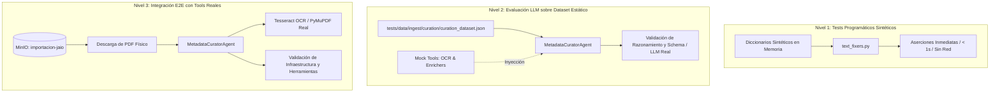

# Guía de Arquitectura de Testing y Evaluación del Agente Curador

Esta guía describe en profundidad la **estrategia de testing en 3 niveles** implementada para el módulo de curación de metadatos (`MetadataCuratorAgent`), el diseño de casos de prueba y los pasos para extender el dataset de evaluación tanto de forma local como en **LangSmith**.

---

## 1. Visión General y Justificación del Diseño

El proceso de curación de metadatos aborda dos tipos de anomalías detectadas en los PDFs:
1. **Anomalías Solucionables Programáticamente (Capa 2a - `text_fixers.py`):** Errores deterministas de espaciado, ligaduras de fuentes, duplicaciones cíclicas o autores concatenados. Se resuelven con expresiones regulares y transformaciones puras en milisegundos.
2. **Anomalías No Solucionables Programáticamente (Capa 2b - `metadata_curator_agent.py`):** Textos gravemente corrompidos, campos faltantes que requieren consultar APIs autoritativas (Crossref / OpenAlex) o layouts en columnas que exigen re-extracción vía OCR con Tesseract.

Para garantizar robustez, reproducibilidad y velocidad, se estableció una **arquitectura de testing híbrida en 3 niveles**:



---

## 2. Los 3 Niveles de Testing

| Nivel | Nombre | Propósito | Dependencias | Tiempo de Ejecución |
| :--- | :--- | :--- | :--- | :--- |
| **Nivel 1** | **Programático Sintético** | Valida que las funciones de `text_fixers.py` reparen anomalías específicas sin efectos secundarios. | Ninguna | `< 1 segundo` |
| **Nivel 2** | **Evaluación con Dataset** | Mide el razonamiento del LLM, el uso adecuado de herramientas y las salidas estructuradas usando mocks de tools deterministas. | API Key LLM (Groq / Nvidia / OpenRouter) | `~10-25 segundos` |
| **Nivel 3** | **Integración E2E** | Valida la conectividad con MinIO, descarga de PDFs y ejecución real de OCR (`pytesseract` / `fitz`). | API Key LLM + MinIO local (`localhost:9003`) | `~5-15 segundos` |

---

### Nivel 1: Tests Programáticos Sintéticos (`TestCorreccionesEspecificasPorTipo`)

* **Ubicación:** `tests/integration/test_metadata_curator_agent.py` → Clase `TestCorreccionesEspecificasPorTipo`
* **Objetivo:** Verificar que las funciones de limpieza de texto funcionen sobre casos sintéticos controlados.
* **Comando para ejecutar:**
```bash
pytest tests/integration/test_metadata_curator_agent.py::TestCorreccionesEspecificasPorTipo -v
```

---

### Nivel 2: Evaluación LLM sobre Dataset Estático (`TestAgenteCurador_DatasetEval`)

* **Ubicación:** `tests/integration/test_metadata_curator_agent.py` → Clase `TestAgenteCurador_DatasetEval`
* **Dataset fuente:** `tests/data/ingest/curation/curation_dataset.json`
* **Mecanismo de Mocking:** Utiliza `unittest.mock.patch.object` sobre el atributo `.func` de las `@tool` (`re_extract_with_ocr` y `validate_with_enrichers`). De esta forma, el LLM decide si llamar a una tool y qué parámetros pasarle, pero la respuesta es provista instantáneamente por el mock definido en el caso de prueba.
* **Comando para ejecutar:**
```bash
pytest tests/integration/test_metadata_curator_agent.py::TestAgenteCurador_DatasetEval -v
```

---

### Nivel 3: Integración E2E con Tools Reales (`TestAgenteCurador_IntegracionE2E`)

* **Ubicación:** `tests/integration/test_metadata_curator_agent.py` → Clase `TestAgenteCurador_IntegracionE2E`
* **Objetivo:** Validar la interacción real con el bucket de MinIO `importacion-jaio`, descargando el binario del PDF y aplicando OCR físico en memoria si el LLM lo solicita.
* **Comando para ejecutar:**
```bash
pytest tests/integration/test_metadata_curator_agent.py::TestAgenteCurador_IntegracionE2E -v
```

---

## 3. Mecánica Interna de los Tests del Nivel 2

Esta sección explica en detalle cómo funciona el motor de parametrización y el sistema de mocking que sustenta la clase `TestAgenteCurador_DatasetEval`.

### 3.1. Parametrización desde el Dataset JSON

El dataset de evaluación (`tests/data/ingest/curation/curation_dataset.json`) es un array de objetos JSON. Cada objeto representa un caso de prueba independiente con su `input`, `mock_tools` y `expected_output`.

La función `_cargar_dataset_evaluacion()` se ejecuta **una sola vez** durante la fase de recolección de pytest (antes de correr cualquier test). Retorna la lista completa de casos:

```python
def _cargar_dataset_evaluacion() -> list[dict]:
    path = Path(__file__).parent.parent / "data" / "ingest" / "curation" / "curation_dataset.json"
    with open(path, "r", encoding="utf-8") as f:
        return json.load(f)
```

El decorador `@pytest.mark.parametrize` recibe esa lista y genera **un test idéntico por cada dict**:

```python
@pytest.mark.parametrize(
    "caso", _cargar_dataset_evaluacion(), ids=lambda c: c["case_name"]
)
class TestAgenteCurador_DatasetEval:
    ...
```

- `"caso"`: nombre del parámetro que recibe cada test method.
- Segundo argumento: el iterable (lista de dicts del JSON).
- `ids=lambda c: c["case_name"]`: extrae el nombre legible para el output de pytest.

Si el JSON contiene 3 entradas, pytest crea:

```
TestAgenteCurador_DatasetEval::test_evaluacion_caso[Completa date vacio usando enrichers por ISSN]
TestAgenteCurador_DatasetEval::test_evaluacion_caso[Resuelve titulo residual con OCR]
TestAgenteCurador_DatasetEval::test_evaluacion_caso[Marca titulo como curation_needed si falla OCR y Enrichers]
```

Cada test recibe su dict completo como el parámetro `caso`:

```python
def test_evaluacion_caso(self, caso: dict, agente_curador_fixture):
    fila_input = caso["input"]
    expected_output = caso["expected_output"]
    mock_tools = caso.get("mock_tools", {})
    ...
```

### 3.2. Mecanismo de Mocking de Tools

Las tools del agente (`re_extract_with_ocr` y `validate_with_enrichers`) son funciones Python decoradas con `@tool` de LangChain. Este decorador las envuelve en un objeto `Tool` que expone:

- `.name` / `.description` / `.args_schema`: metadata que se envía al LLM via `bind_tools()` para que sepa qué hacen las tools y cuándo invocarlas.
- `.func`: la implementación Python que se ejecuta cuando el LLM decide llamar a la tool.

Cuando el agente se construye (`build_metadata_curator_agent()`), las tools se vinculan al modelo:

```python
curator_model = _construir_modelo_curador().bind_tools(tools=_CURATOR_TOOLS)
```

Esto le envía al LLM el esquema JSON de cada tool (nombre, parámetros, docstring). El LLM **no ejecuta nada** — solo decide, basándose en el prompt y los datos de la fila, si conviene llamar a una tool y con qué argumentos.

Cuando el LLM emite un tool call, LangGraph lo routea al `ToolNode`, que ejecuta `tool.func(**args)`. El test intercepta ese punto reemplazando `.func`:

```python
patch.object(
    ...re_extract_with_ocr, "func",
    side_effect=lambda **kwargs: ocr_mock   # reemplaza la función real
)
```

Esto sustituye la implementación real de `re_extract_with_ocr.func` por un lambda que retorna el dict definido en `mock_tools` del caso de prueba (ej. `{"texto_extraido": "...", "ocr_applied": true}`).

### 3.3. Flujo Completo de Un Test del Nivel 2

```
1. pytest carga el caso del JSON → dict con input, mock_tools, expected_output
2. Se inyectan los mocks (patch.object sobre .func de cada tool)
3. Se invoca el agente con la fila de input via construir_mensaje_curacion()
4. El LLM lee la fila + anomalias → decide si llamar tools
5. Si el LLM decide llamar a re_extract_with_ocr(pdf_path=...):
     → ToolNode ejecuta .func(pdf_path=...)
     → El mock retorna {"texto_extraido": "Estimacion de texturas", ...}
6. El LLM recibe esa respuesta como ToolMessage
7. El LLM integra el resultado y genera la corrección final (JSON estructurado)
8. parsear_respuesta_agente() extrae las correcciones del JSON del LLM
9. Se busca la corrección correspondiente al ID de la fila de input
10. Se comparan los campos de la corrección contra expected_output
```

El LLM **no sabe** que los tools están mockeados. Para él, es como si las tools devolvieran respuestas reales. La única diferencia es velocidad (milisegundos vs. segundos) y determinismo (siempre la misma respuesta para el mismo caso).

---

## 4. Cómo Agregar Nuevos Casos de Prueba al Dataset

Todos los casos de evaluación del **Nivel 2** se definen en el archivo [`tests/data/ingest/curation/curation_dataset.json`](file:///home/santi/Documentos/LangGraph/Modulo-Marta/tests/data/ingest/curation/curation_dataset.json).

### Estructura y Formato del Esquema JSON

Cada entrada en el array JSON representa un caso de prueba independiente con la siguiente estructura:

```json
{
  "case_name": "Nombre descriptivo y único del caso de prueba",
  "description": "Explicación del problema que presenta la fila y el comportamiento esperado del agente.",
  "input": {
    "id": "identificador-del-archivo.pdf",
    "title": "Texto del título (puede incluir anomalías)",
    "description": "Resumen o abstract",
    "author": "Autores normalizados",
    "issn": "XXXX-XXXX",
    "doi": "10.xxxx/yyyy",
    "_curation": {
      "anomalias": {
        "nombre_campo": ["TIPO_DE_ANOMALIA"]
      },
      "score": 0.8
    }
  },
  "mock_tools": {
    "re_extract_with_ocr": {
      "texto_extraido": "Texto que devolverá la tool de OCR cuando el agente la llame.",
      "ocr_applied": true
    },
    "validate_with_enrichers": {
      "found": true,
      "strategy": "openalex_issn",
      "data": {
        "date": "2010",
        "publisher": "SADIO"
      }
    }
  },
  "expected_output": {
    "campo_corregido": "Valor esperado que el agente debe devolver",
    "campo_curation_needed": true
  }
}
```

---

### Descripción Detallada de Campos

| Campo | Tipo | Obligatorio | Descripción |
| :--- | :--- | :--- | :--- |
| `case_name` | `string` | **Sí** | Identificador visible en los reportes de pytest y LangSmith. |
| `description` | `string` | **Sí** | Contexto del caso para documentación y trazabilidad. |
| `input` | `dict` | **Sí** | El estado de la fila que recibirá el agente. Debe incluir `id`, los metadatos relevantes y `_curation.anomalias`. |
| `mock_tools` | `dict` | No | Respuestas simuladas para las herramientas (`re_extract_with_ocr` y/o `validate_with_enrichers`). Si el caso no requiere invocar tools, se omite o se deja `{}`. |
| `expected_output` | `dict` | **Sí** | Valores exactos que deben verificarse en la respuesta del agente (ej. el campo corregido o el flag `_curation_needed`). |

---

### Tipos de Anomalías Reconocidas por el Pipeline

Al configurar el campo `_curation.anomalias`, utiliza los identificadores canónicos del sistema:

* `CHARS_DISPERSOS`: Caracteres separados por espacios espurios (ej. `M o d e l o`).
* `ARTEFACTOS_CID`: Caracteres corruptos de fuentes PDF (`(cid:27)`).
* `REPETICION_CICLICA`: Frases o párrafos repetidos periódicamente.
* `TEXTO_PEGADO`: Palabras unidas sin espacios (`Enelmarcodelfiltrado`).
* `CAMPO_VACIO`: Campo obligatorio ausente (`title`, `date`, `author`).
* `LONGITUD_ANOMALA`: Textos sospechosamente cortos o truncados.

---

### Ejemplos Prácticos de Casos

#### Ejemplo 1: Completar Fecha Faltante vía Enricher (OpenAlex / Crossref)
```json
{
  "case_name": "Completa date vacio usando enrichers por ISSN",
  "description": "Fila con CAMPO_VACIO en date pero con ISSN valido. El agente debe usar validate_with_enrichers y completar date.",
  "input": {
    "id": "39-jaiio-ast-09.pdf-PDFA.pdf",
    "title": "Sistema de navegación para robots autónomos",
    "author": "Perez, Juan ||| Gomez, Maria",
    "issn": "1850-2806",
    "_curation": {
      "anomalias": {
        "date": ["CAMPO_VACIO"]
      },
      "score": 0.5
    }
  },
  "mock_tools": {
    "validate_with_enrichers": {
      "found": true,
      "strategy": "openalex_issn",
      "data": {
        "date": "2010",
        "source": "Anales de JAIIO"
      }
    }
  },
  "expected_output": {
    "date": "2010"
  }
}
```

#### Ejemplo 2: Re-extracción de Título con OCR
```json
{
  "case_name": "Resuelve titulo residual con OCR",
  "description": "Fila con CHARS_DISPERSOS en title. El agente llama a re_extract_with_ocr y obtiene el titulo corregido.",
  "input": {
    "id": "39-jaiio-ast-06.pdf-PDFA.pdf",
    "title": "R e c o n o c i m i e n t o   d e   p a t r o n e s",
    "_curation": {
      "anomalias": {
        "title": ["CHARS_DISPERSOS"]
      },
      "score": 0.8
    }
  },
  "mock_tools": {
    "re_extract_with_ocr": {
      "texto_extraido": "Reconocimiento de patrones en imágenes satelitales",
      "ocr_applied": true
    }
  },
  "expected_output": {
    "title": "Reconocimiento de patrones en imágenes satelitales"
  }
}
```

#### Ejemplo 3: Marcado de Revisión Manual (`_curation_needed`)
```json
{
  "case_name": "Marca titulo como curation_needed si falla OCR y Enrichers",
  "description": "Registro ilegible sin identificadores donde las tools fallan. El agente no debe inventar metadatos y debe activar el flag.",
  "input": {
    "id": "dummy-ilegible.pdf",
    "title": "xxxxxxxxxxxxxxxxxxxxxxxxxxxxxxxx",
    "_curation": {
      "anomalias": {
        "title": ["CHARS_DISPERSOS"]
      },
      "score": 0.9
    }
  },
  "mock_tools": {
    "re_extract_with_ocr": {
      "texto_extraido": "xxx yyy zzz jjjj",
      "ocr_applied": true
    },
    "validate_with_enrichers": {
      "found": false,
      "strategy": "none"
    }
  },
  "expected_output": {
    "title_curation_needed": true
  }
}
```

---

## 5. Evaluación Formal en LangSmith

Para medir el rendimiento de diferentes modelos LLM (Groq vs Nvidia NIM vs OpenRouter) o realizar pruebas de regresión, se utiliza el script [`scripts/evaluate_curation_agent.py`](file:///home/santi/Documentos/LangGraph/Modulo-Marta/scripts/evaluate_curation_agent.py).

### Funcionamiento del Evaluador
1. **Sincronización:** Lee `tests/data/ingest/curation/curation_dataset.json` y sube los ejemplos al dataset remoto `Metadata_Curator_Evaluation` en LangSmith.
2. **Ejecución:** Corre el agente asincrónicamente inyectando los mocks correspondientes a cada ejemplo.
3. **Métrica `exact_match`:** Compara las claves de `expected_output` contra la salida del modelo. Devuelve `1.0` si todos los campos coinciden exactamente o `0.0` si falta alguno o hay discrepancias.

### Cómo ejecutar la evaluación en LangSmith

```bash
# 1. Asegurarse de tener configuradas las variables de entorno
export LANGSMITH_API_KEY="lsv2_pt_..."
export LANGSMITH_PROJECT="Bulk-Importation-Workflow"
export GROQ_API_KEY="gsk_..."

# 2. Ejecutar el script
python scripts/evaluate_curation_agent.py
```

En la consola y en el panel web de LangSmith verás el experimento registrado con el prefijo `MetadataCurator-Eval-*` con el detalle de ejecuciones paso a paso, latencias y tasa de acierto.

---

## 6. Resumen de Comandos de Testing

```bash
# Ejecutar toda la suite de curación (Niveles 1, 2 y 3)
pytest tests/integration/test_metadata_curator_agent.py -v

# Ejecutar solo tests rápidos y deterministas (Nivel 1)
pytest tests/integration/test_metadata_curator_agent.py::TestCorreccionesEspecificasPorTipo -v

# Ejecutar solo la evaluación de dataset local (Nivel 2)
pytest tests/integration/test_metadata_curator_agent.py::TestAgenteCurador_DatasetEval -v

# Ejecutar test de integración física con MinIO y OCR (Nivel 3)
pytest tests/integration/test_metadata_curator_agent.py::TestAgenteCurador_IntegracionE2E -v

# Ejecutar benchmark formal en LangSmith
python scripts/evaluate_curation_agent.py
```
