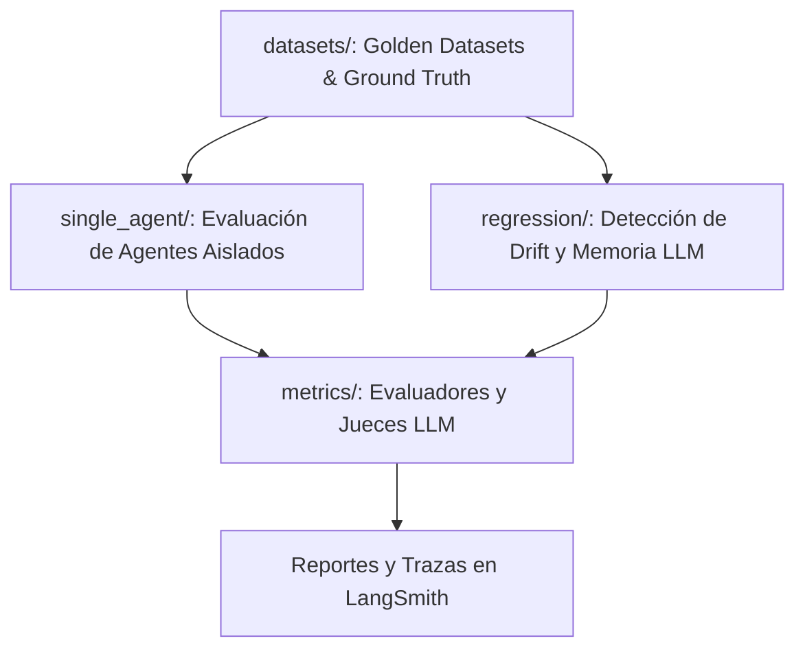

# Evaluación Agéntica y Regresión Semántica — `tests/evals/`

[← Volver a tests/](../README.md)

---

## 🎯 Propósito y Finalidad

El directorio `tests/evals/` alberga el marco de evaluación empírica y cuantitativa para los componentes agénticos y modelos de lenguaje (LLMs) utilizados en el pipeline de importación masiva.

A diferencia del software tradicional con salidas deterministas, los componentes asistidos por LLM (`SourceCrosswalkAgent`, `MetadataCuratorAgent`, `DedupRecoveryAgent`) son probabilísticos. Este marco garantiza que:
1. Las capacidades de razonamiento, extracción y mapeo se midan numéricamente con respecto a conjuntos de datos de referencia (*Ground Truth*).
2. Se detecten degradaciones de rendimiento (*Semantic Drift*) provocadas por actualizaciones de prompts o cambios de versión de los modelos subyacentes.
3. El agente de recuperación reactiva mantenga altas tasas de acierto sin introducir alucinaciones en los metadatos institucionales.
4. Los costos operativos de tokens y los tiempos de latencia se mantengan acotados y predecibles para la tesis.

---

## 🔍 Qué se Evalúa

La suite de evaluación se organiza en cuatro subcarpetas metodológicas:



- **[datasets/](datasets/README.md):** Datasets versionados, casos límite curados y tablas de equivalencias esperadas (*Golden Sets*).
- **[single_agent/](single_agent/README.md):** Pruebas de capacidad atómica sobre cada agente individual (adherencia al esquema JSON, control de alucinaciones, detección de campos obligatorios).
- **[regression/](regression/README.md):** Detección de drift en configuraciones de crosswalk y evaluación semántica del agente de autorreparación ante anomalías de deduplicación (`test_crosswalk_drift.py`, `test_dedup_recovery_llm_eval.py`).
- **[metrics/](metrics/README.md):** Implementación de evaluadores heurísticos (Levenshtein, Exact Match) y jueces LLM (*LLM-as-a-Judge*) para calificar la calidad semántica de los metadatos curados.

---

## 🛡️ Aislamiento del CI y Gestión de Costos

> [!WARNING]
> Las pruebas en `tests/evals/` **NO se ejecutan en los flujos estándar de Integración Continua (CI)** asociados a cada `git push` o `pull request`.
> 
> **Razones de Aislamiento:**
> 1. **Consumo de Fondos (Tokens Reales):** Cada ejecución consume miles de tokens en APIs comerciales (Groq, OpenRouter, Nvidia NIM, OpenAI).
> 2. **Latencia de Red:** La inferencia agéntica puede tomar desde varios minutos hasta decenas de minutos según el tamaño del lote.
> 3. **Variabilidad Estocástica:** Aunque se configure `temperature=0.0`, las APIs externas pueden presentar ligeras variaciones que no deben quebrar el pipeline de compilación regular.

---

## 🚀 Cómo Ejecutar los Tests

Para ejecutar las evaluaciones se requiere configurar las claves de API correspondientes en el archivo `.env`:
```bash
export OPENROUTER_API_KEY="sk-..."
export GROQ_API_KEY="gsk_..."
```

### Comandos de Pytest:

```bash
# 1. Ejecutar todas las evaluaciones agénticas
pytest tests/evals/ -m eval -v

# 2. Ejecutar la suite de evaluación semántica en tiempo real (mostrando stdout)
pytest tests/evals/regression/test_dedup_recovery_llm_eval.py -s -v

# 3. Ejecutar como script independiente con reporte visual
python -m tests.evals.regression.test_dedup_recovery_llm_eval

# 4. Ejecutar pruebas de detección de schema drift
pytest tests/evals/regression/test_crosswalk_drift.py -v
```

---

## 📦 Dependencias y Matriz de Costos

| Tipo de Evaluación | Modelo Típico | Duración Estimada | Costo Estimado (USD) | Frecuencia Sugerida |
|:---|:---|:---:|:---:|:---|
| **Detección de Drift** | Llama-3.3-70B / DeepSeek-V3 | ~15 - 30 seg | ~$0.01 | Semanal o ante cambio de prompt |
| **Recuperación Reactiva (Eval)** | Llama-3.1-8B-Instant / Groq | ~30 - 60 seg | ~$0.02 | Al modificar prompts o CBR |
| **Evaluación Agente Curador** | Llama-3-70B vía OpenRouter | ~2 - 4 min | ~$0.10 | Al refactorizar lógica de PDF |
| **Benchmark Completo de Tesis** | Modelos variados | ~10 - 20 min | ~$0.30 - $0.50 | Para recolección de métricas de tesis |
