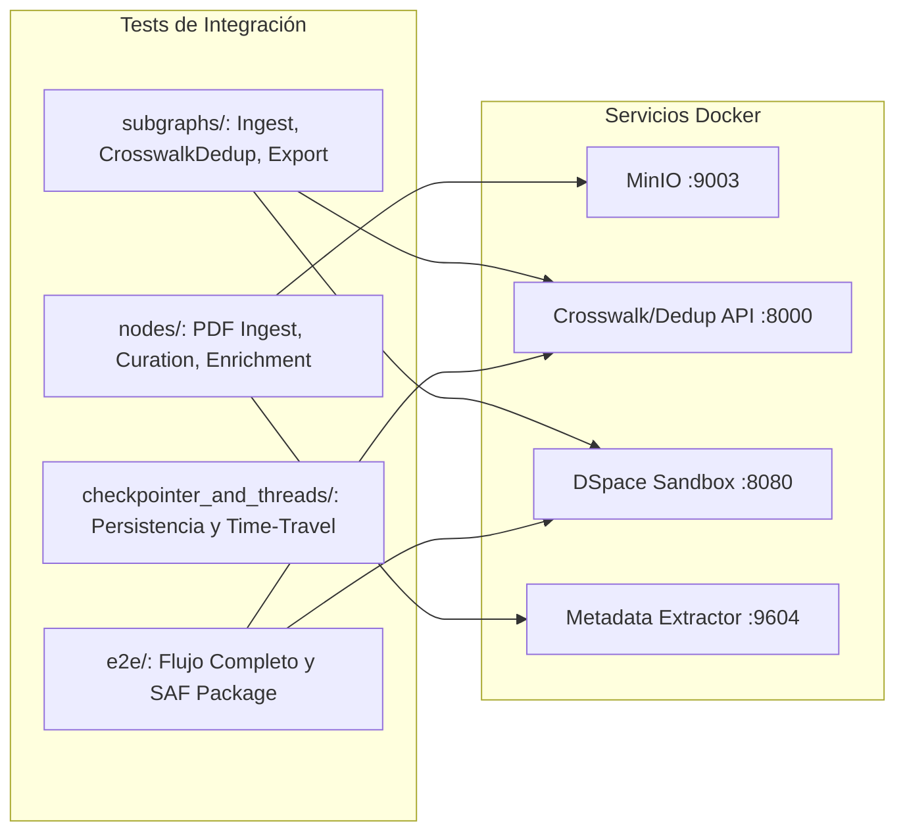

# Pruebas de Integración — `tests/integration/`

[← Volver a tests/](../README.md)

---

## 🎯 Propósito y Finalidad

El directorio `tests/integration/` aloja las pruebas de integración del pipeline de importación masiva. Su finalidad es verificar que los módulos desacoplados, los subgrafos de LangGraph y los microservicios externos operen en conjunto de manera armónica, respetando los contratos de red, los esquemas de persistencia y el ciclo de vida de los datos.

A diferencia de las pruebas unitarias, aquí se valida la **interoperabilidad física del sistema** con servicios reales emulados o desplegados en contenedores locales (Docker, MinIO, API de Deduplicación/Crosswalk y DSpace 7+ Sandbox).

---

## 🔍 Qué se Evalúa

La suite de integración está estructurada en cuatro frentes principales y varias suites directas de validación:



### Componentes y Subdirectorios:
- **[subgraphs/](subgraphs/README.md):** Verificación de la compilación y ejecución E2E de cada subgrafo individual (`IngestSubgraph`, `CrosswalkDedupSubgraph`, `ExportSubgraph`).
- **[nodes/](nodes/README.md):** Validación de nodos individuales que dependen de servicios de infraestructura (MinIO S3, OCR, MCP).
- **[checkpointer_and_threads/](checkpointer_and_threads/README.md):** Persistencia de estado en LangGraph, Time-Travel, puntos de interrupción (`interrupt`) y reanudación idempotente (`resume`).
- **[e2e/](e2e/README.md):** Pruebas de extremo a extremo que ejecutan el pipeline completo ensamblado desde los datos crudos hasta el depósito final en DSpace.

### Suites Adicionales en la Raíz de `tests/integration/`:
- `test_metadata_curator_agent.py`: Suite de 3 niveles del Agente Curador (Sintético, Dataset Eval con LangSmith, y E2E con MinIO y Tesseract OCR).
- `test_graph_steps.py`: Verificación secuencial del grafo legacy (en proceso de transición hacia subgrafos).
- `test_pipeline_evaluation.py` y `test_source_config_generator.py`: Benchmarks cuantitativos y trazabilidad en LangSmith.

---

## 🚀 Cómo Ejecutar los Tests

### Requisitos Previos:
Tener los contenedores locales activos mediante Docker Compose:
```bash
docker compose up -d deduplicator_crosswalk_web minio dspace
```

### Comandos de Ejecución:

```bash
# 1. Ejecutar toda la suite de integración
pytest tests/integration/ -v

# 2. Ejecutar por marcador pytest
pytest -m integration -v

# 3. Ejecutar exclusivamente los subgrafos
pytest tests/integration/subgraphs/ -v

# 4. Ejecutar saltando tests que requieran MinIO si el contenedor no está activo
pytest tests/integration/ -m "not minio" -v
```

---

## 📦 Dependencias y Costos

| Recurso | Requisito | Comportamiento si no está disponible |
|:---|:---|:---|
| **Crosswalk & Deduplicator API** | `http://localhost:8000` | Fallo de test o skip según marca de fixture |
| **MinIO Object Storage** | `http://localhost:9003` | Se salta automáticamente con `@pytest.mark.skipif` |
| **DSpace 7+ Sandbox** | `http://localhost:8080/server` | Se verifica estado vía health check antes de ejecutar |
| **LLM APIs (Groq / OpenRouter)** | API Key en entorno | Usado en tests específicos de agentes (consumo mínimo <$0.02) |

- **Tiempo Estimado de Ejecución:** ~1 a 3 minutos (dependiendo de la velocidad de respuesta de los contenedores locales).
