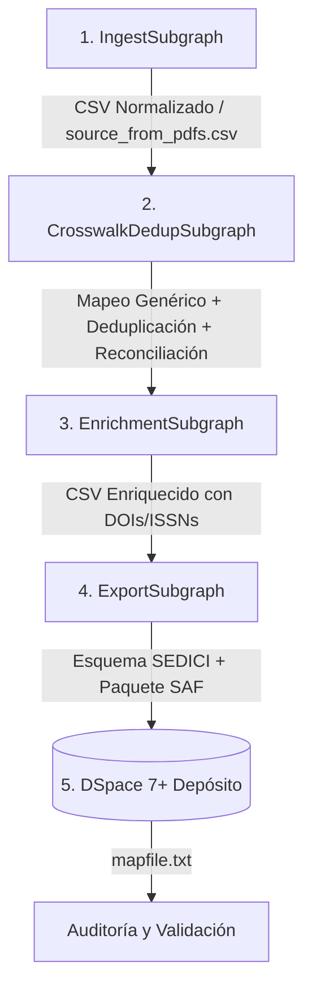

# Pruebas de Integración Extremo a Extremo — `tests/integration/e2e/`

[← Volver a tests/integration/](../README.md)

---

## 🎯 Propósito y Finalidad

El directorio `tests/integration/e2e/` aloja las pruebas de integración de extremo a extremo (End-to-End / E2E) para el pipeline completo de importación masiva coordinado en `core/graph.py`.

Estas pruebas representan el máximo nivel de validación antes del pase a producción o despliegue institucional: orquestan los cuatro subgrafos en secuencia continua sobre conjuntos de datos representativos, validando que el flujo opere de forma ininterrumpida desde la ingesta de los archivos de entrada hasta la persistencia física en el repositorio DSpace institucional y la generación del archivo de trazabilidad `mapfile.txt`.

---

## 🔍 Qué se Evalúa

El flujo E2E valida la interacción coordinada de todas las fases del ciclo de vida de los datos:



### Invariantes y Contratos Clave:
1. **Flujo de Datos Ininterrumpido:** Verificación de que las rutas a los archivos CSV intermedios generados por cada subgrafo (`generic_source_csv_path`, `reconciled_csv_path`, etc.) sean reconocidas y procesadas por los subgrafos sucesores sin corrupción de codificación ni pérdida de columnas.
2. **Reconciliación de Metadatos:** En registros duplicados contra el repositorio local, se comprueba que se respeten las políticas de fusión (conservando los identificadores internos y campos clave de SEDICI).
3. **Generación del Paquete SAF (*Simple Archive Format*):**
   - Creación correcta de la estructura de directorios `item_001/`, `item_002/`, etc.
   - Generación de `dublin_core.xml` y `metadata_sedici.xml` cumpliendo los esquemas XSD requeridos por DSpace.
   - Generación del archivo `contents` apuntando a los archivos de texto o PDFs anexos.
4. **Interacción con DSpace REST:**
   - Ingesta en la colección de prueba configurada (`dspace_collection`).
   - Generación del archivo `mapfile.txt` conteniendo la correspondencia entre los IDs del lote y los *Handles* definitivos emitidos por DSpace.
   - Comprobación posterior mediante consulta REST a `/server/api/core/items` para validar que el ítem sea recuperable y consultable.

---

## 🚀 Cómo Ejecutar los Tests

### Requisitos Previos:
Tener los servicios de infraestructura levantados en Docker:
```bash
docker compose up -d deduplicator_crosswalk_web dspace minio
```

### Comandos de Ejecución:

```bash
# Ejecutar la suite completa E2E
pytest tests/integration/e2e/ -v

# Ejecutar con registro detallado de pasos por consola
pytest tests/integration/e2e/ -v -s --log-cli-level=INFO
```

---

## 📦 Dependencias y Costos

- **Servicios Requeridos:**
  - Instancia DSpace 7+ Sandbox activa y accesible.
  - Microservicio de Crosswalk y Deduplicación en `http://localhost:8000`.
  - MinIO Object Storage (si se prueba la rama de ingesta desde PDFs).
- **Tiempo Estimado de Ejecución:** ~2 a 5 minutos por corrida completa.
- **Costo en Tokens de LLM:** ~$0.02 a $0.05 si el flujo E2E utiliza modelos LLM en la fase de mapeo de crosswalk o curación.
